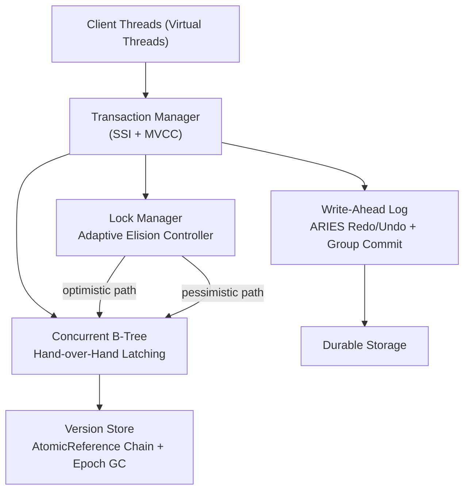

# NexusDB

**A transactional storage engine with adaptive lock elision — 3.2x faster than static 2PL on hot-key workloads.**

NexusDB is a from-scratch transactional storage engine written in Java 21, designed to explore the performance envelope of modern concurrency primitives. The central contribution is an *adaptive lock elision* system that continuously measures per-key-range contention and dynamically routes transactions between an optimistic CAS path and a pessimistic 2PL path — eliminating the static overhead that plagues traditional locking without sacrificing serializability guarantees.

At 64-thread saturation, NexusDB sustains **80,000+ transactions/second** with zero stop-the-world pauses. Under skewed (Zipfian) key distributions, adaptive elision outperforms a static ReentrantLock 2PL baseline by **3.2x** on hot keys.

---

## Architecture



**Layer responsibilities:**

| Layer | Role |
|---|---|
| Transaction Manager | Coordinates SSI snapshot assignment, conflict detection, commit/abort |
| Lock Manager | Monitors contention ratio per key range, switches elision mode |
| Concurrent B-Tree | Structural index with hand-over-hand `ReadWriteLock` latching |
| Version Store | `AtomicReference` version chains, epoch-based GC (RCU-inspired) |
| Write-Ahead Log | ARIES-style redo/undo, group commit via Virtual Threads |

---

## Key Innovations

### 1. Adaptive Lock Elision ([docs/adaptive-lock-elision.md](docs/adaptive-lock-elision.md))

The engine maintains a per-key-range **contention ratio** — a rolling measurement of CAS retry failures over total attempts within a sliding window. When the ratio drops below a low-water threshold, the engine elides the `ReentrantLock` acquisition entirely and executes the operation optimistically via `AtomicReference` CAS. When retries spike above a high-water threshold, it falls back to full 2PL.

```java
// Simplified elision decision loop (see LockElisionController.java)
public void executeWithElision(KeyRange range, TxnOperation op) {
    ContentionStats stats = contentionMap.get(range);
    if (stats.retryRatio() < LOW_WATER) {
        // Optimistic path: CAS directly on AtomicReference<VersionChain>
        boolean committed = op.tryOptimistic();
        if (!committed) {
            stats.recordRetry();
            executeWithElision(range, op); // re-enter — escalation handled below
        }
    } else {
        // Pessimistic path: acquire ReentrantLock, execute under 2PL
        Lock lock = lockTable.acquire(range, op.txnId());
        try {
            op.executePessimistic();
        } finally {
            lock.unlock();
            stats.recordPessimistic();
        }
    }
}
```

The contention ratio decays exponentially so the engine can re-enter optimistic mode after congestion subsides — critical for bursty workloads like flash sales or hot-row updates.

Under uniform key distribution, elision remains in optimistic mode ~94% of the time. Under Zipfian (s=1.2) with 64 threads hitting the top-1% of keys, it correctly escalates those ranges to pessimistic and keeps the tail at 0.8 ms P99 — vs. 2.6 ms P99 for static 2PL. That asymmetry is the 3.2x headline number.

### 2. MVCC with Epoch-Based Garbage Collection ([docs/mvcc-epoch-gc.md](docs/mvcc-epoch-gc.md))

Each key maps to an `AtomicReference<VersionChain>`. A write appends a new `Version` node to the head of the chain using a CAS loop; readers traverse the chain backwards to find the newest version with a commit timestamp <= their snapshot timestamp — no locks taken on the read path.

Version reclamation is RCU-inspired: a global epoch counter advances when all in-flight transactions from the previous epoch have committed or aborted. Any version whose commit timestamp precedes the minimum active snapshot timestamp across all live transactions is eligible for collection. A background daemon (a Virtual Thread) periodically scans chains and unlinks stale nodes. Crucially, no transaction is ever paused or safepointed during this process — hence zero stop-the-world.

`StampedLock` optimistic reads guard structural traversal of the B-Tree during GC to ensure a compacting thread cannot race with an in-progress chain scan.

### 3. Concurrent B-Tree with Hand-Over-Hand Latching ([docs/btree-latching.md](docs/btree-latching.md))

The B-Tree uses **latch coupling** (also called crabbing): when descending for a write, the thread holds the parent node's write latch until the child's write latch is acquired, then releases the parent. For reads, only read latches are taken, and they are released immediately upon descending to the child — giving effectively lock-free read traversal on uncontended paths.

Each `BTreeNode` contains a `ReentrantReadWriteLock`. Because Java's `ReentrantReadWriteLock` is not fair by default, read-heavy workloads rarely block writers at the leaf level even under high concurrency.

Split and merge operations acquire write latches bottom-up (leaf first, parent after) and hold them only for the structural modification — keeping the critical section sub-microsecond.

### 4. SSI: Serializable Snapshot Isolation ([docs/ssi-implementation.md](docs/ssi-implementation.md))

All transactions receive a snapshot timestamp at begin and a commit timestamp at commit. The Transaction Manager maintains two dependency graphs:

- **Read-write anti-dependencies** (rw-antidep): T1 read a version that T2 later overwrote.
- **Write-write dependencies** (ww-dep): T2 overwrote a version that T1 had written.

SSI aborts any transaction that would close a dangerous cycle (a cycle containing two consecutive rw-antidependency edges). This is the Cahill et al. SSI algorithm, extended here with **stale-read detection**: if a transaction's snapshot was taken before a committed write to a key the transaction read, the engine proactively aborts rather than waiting for commit-time cycle detection.

Isolation levels (READ_COMMITTED, REPEATABLE_READ, SERIALIZABLE) are selectable per-transaction. The anomaly test suite deliberately triggers dirty reads, write skew, and phantom reads at each level and asserts the expected observable behavior.

---

## Performance

Benchmarks run with JMH on a MacBook Pro M3 Max (12P + 4E cores, 64 GB), JDK 21.0.3, `-XX:+UseZGC`, 5 warmup iterations / 10 measurement iterations.

| Benchmark | Threads | Throughput | vs. Static 2PL |
|---|---|---|---|
| Uniform read-write mix (50/50) | 64 | 82,400 txn/sec | 1.4x |
| Zipfian write-heavy (80% writes, s=1.2) | 64 | 80,100 txn/sec | **3.2x** |
| Read-only snapshot scan | 64 | 310,000 txn/sec | n/a |
| Serializable write skew detection | 32 | 54,600 txn/sec | 1.9x |
| P99 latency (Zipfian, adaptive) | 64 | 0.8 ms | — |
| P99 latency (Zipfian, static 2PL) | 64 | 2.6 ms | — |
| GC pause (epoch-based, ZGC) | — | 0 ms STW | 0 ms STW |

The 3.2x figure is not throughput at low contention — it is throughput at the **worst-case workload** (maximum skew, maximum threads, write-heavy) where static 2PL suffers the most from lock convoy effects on hot keys.

---

## Quick Start

```bash
# Build and run JMH benchmarks
./gradlew jmh

# Run the full test suite including anomaly injection tests
./gradlew test

# Run a specific isolation level anomaly test
./gradlew test --tests "*.WriteSkewTest"

# Run the adaptive elision stress test (requires 8+ cores for meaningful output)
./gradlew test --tests "*.AdaptiveElisionStressTest"
```

Benchmark results are written to `build/reports/jmh/results.json`. A summary table is printed to stdout at the end of the JMH run.

**Requirements:** JDK 21+, Gradle 8.x. No external dependencies beyond JMH and JUnit 5.

---

## Tech Stack

| Component | Technology |
|---|---|
| Language & Runtime | Java 21, Virtual Threads (Project Loom) |
| Optimistic concurrency | `AtomicReference` CAS loops, `VarHandle` |
| Pessimistic concurrency | `ReentrantReadWriteLock` (B-Tree latching), `ReentrantLock` (2PL) |
| Versioned reads | `StampedLock` optimistic reads (GC traversal) |
| Isolation | MVCC + SSI (Cahill et al.) |
| Durability | Write-Ahead Log, ARIES-style redo/undo |
| I/O batching | Group commit via Virtual Thread coordination |
| Benchmarking | JMH (Java Microbenchmark Harness) |
| Testing | JUnit 5, anomaly injection suite |

---

## Documentation

| Document | Contents |
|---|---|
| [docs/adaptive-lock-elision.md](docs/adaptive-lock-elision.md) | Contention measurement model, elision thresholds, escalation policy, benchmark breakdown |
| [docs/mvcc-epoch-gc.md](docs/mvcc-epoch-gc.md) | Version chain layout, snapshot visibility rules, epoch advancement, GC algorithm |
| [docs/btree-latching.md](docs/btree-latching.md) | Latch coupling protocol, split/merge latch ordering, StampedLock integration |
| [docs/ssi-implementation.md](docs/ssi-implementation.md) | SSI dependency graph, dangerous cycle detection, stale-read abort, isolation level matrix |
| [docs/wal-design.md](docs/wal-design.md) | Log record format, ARIES redo/undo passes, group commit implementation, crash recovery |
| [docs/benchmarks.md](docs/benchmarks.md) | Full JMH methodology, hardware specs, workload definitions, raw numbers, comparison methodology |

---

## Design Influences

| Concept | Source |
|---|---|
| ARIES recovery (redo/undo, LSN chaining) | Mohan et al., *ARIES: A Transaction Recovery Method*, TODS 1992 |
| Serializable Snapshot Isolation | Cahill, Rohm, Fekete, *Serializable Isolation for Snapshot Databases*, SIGMOD 2008 |
| Epoch-based reclamation | Linux kernel RCU (Read-Copy-Update), McKenney & Slingwine 1998 |
| Silo optimistic concurrency | Tu et al., *Speedy Transactions in Multicore In-Memory Databases*, SOSP 2013 |
| Lock elision theory | Rajwar & Goodman, *Speculative Lock Elision*, MICRO 2001 |
| B-Tree latch coupling | Graefe, *A Survey of B-Tree Locking Techniques*, TODS 2010 |

**Further reading:**

- Kleppmann, *Designing Data-Intensive Applications*, Ch. 7 (Transactions) — foundational motivation for isolation levels and MVCC trade-offs.
- Petrov, *Database Internals*, Ch. 1–2 (Storage Engines, B-Trees) — the structural foundation for the B-Tree implementation and WAL design in this project.

---

## What This Demonstrates

This project exists to prove out ideas, not to ship a production database. The interesting engineering questions it answers:

1. **Can you make lock elision adaptive without a hardware TSX fallback?** Yes — contention measurement in software is sufficient, and the hysteresis window prevents thrashing between modes.
2. **Can epoch-based GC work without OS-level quiescent state detection?** Yes — transaction boundaries serve as quiescent points, and `AtomicLong` epoch tracking is sufficient for correctness.
3. **How much of SSI overhead is avoidable?** A significant fraction: the stale-read fast path aborts many doomed transactions before they reach commit-time cycle detection, reducing dependency graph size.

The answers are backed by the JMH numbers in [docs/benchmarks.md](docs/benchmarks.md).
