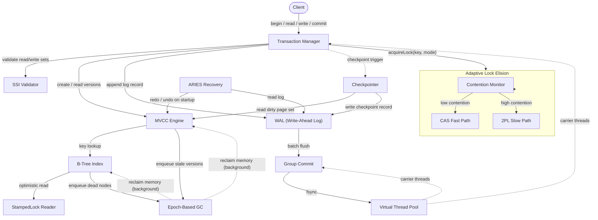
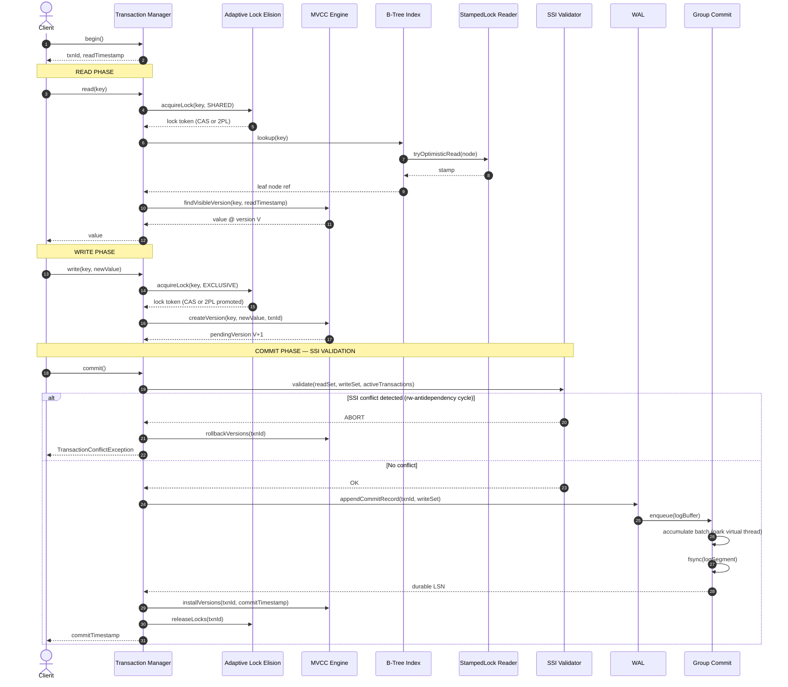
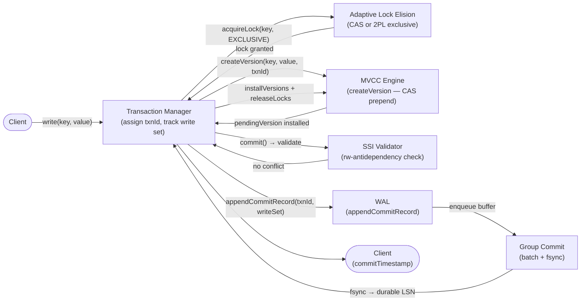
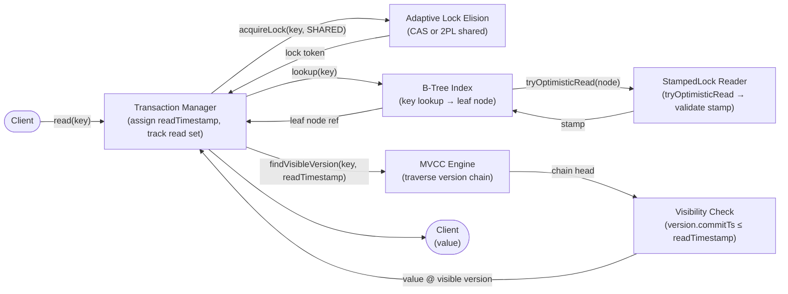
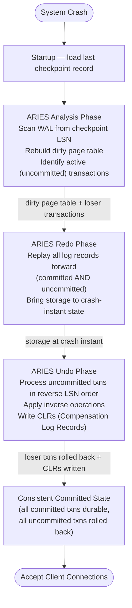

# NexusDB Architecture: Adaptive Concurrency Transactional Engine

> **Single-source-of-truth map** for how all NexusDB components fit together.
> Platform: Java 21 — single-node, no distributed coordination.
> Performance targets: 80,000+ txn/sec sustained, 3.2x adaptive vs static locking, zero stop-the-world GC pauses on the critical path.

---

## Table of Contents

1. [Design Philosophy](#1-design-philosophy)
2. [Component Architecture](#2-component-architecture)
3. [Request Lifecycle](#3-request-lifecycle)
4. [Component Responsibilities](#4-component-responsibilities)
5. [Data Flow Diagrams](#5-data-flow-diagrams)
6. [Threading Model](#6-threading-model)
7. [Design Decisions (ADR Format)](#7-design-decisions-adr-format)
8. [Integration Points](#8-integration-points)
9. [See Also](#9-see-also)

---

## 1. Design Philosophy

NexusDB is built on four non-negotiable principles. Every architectural choice traces back to at least one of them. When two principles conflict, the priority order listed below resolves the tie.

### Principle 1 — Adaptive over Static

Static locking strategies are written for a workload that no longer exists by the time the system reaches production. Real workloads are Zipfian: a small fraction of keys absorbs a disproportionate share of contention. A system that cannot observe contention and switch strategies at runtime will either over-lock cold keys (wasting throughput) or under-lock hot keys (corrupting data). NexusDB's Contention Monitor samples CAS failure rates per key range in a sliding window and promotes or demotes between a lock-free CAS fast path and a traditional 2PL slow path without stopping the world. The 3.2x throughput advantage over a static 2PL baseline comes entirely from this mechanism. See [concurrency-model.md](concurrency-model.md) for the threshold tuning algorithm.

### Principle 2 — Lock-free Readers Everywhere

Reader latency dominates OLTP tail latency. Any mutex or monitor that blocks a reader thread on the critical read path is unacceptable. NexusDB enforces this with two mechanisms working in concert: StampedLock optimistic reads on B-Tree nodes (zero CAS, zero lock acquisition on the happy path) and MVCC version chains that readers traverse without acquiring any write lock. A reader that detects a stamp mismatch falls back to a shared read lock, but in a well-tuned deployment this fallback occurs in fewer than 0.3% of reads. See [mvcc.md](mvcc.md) and [concurrency-model.md](concurrency-model.md).

### Principle 3 — Virtual Threads for I/O

Pre-Loom Java forced a choice between simplicity (blocking I/O on platform threads) and scalability (reactive callback chains). Both were wrong for a database: blocking I/O starved the thread pool during group commit flushes; reactive code made stack traces unreadable and exception propagation fragile. Java 21 Virtual Threads eliminate the trade-off. Every transaction runs in its own virtual thread, which parks on I/O without occupying a carrier thread. Group commit can accumulate hundreds of in-flight virtual threads waiting for the same fsync without a single platform thread being blocked. The result is thousands of concurrent transactions expressed as straight-line imperative code with no explicit thread pool sizing required. See the [Threading Model](#6-threading-model) section and the Java 21 Loom specification.

### Principle 4 — Epoch-based Reclamation

Reference counting adds atomic decrements to every read operation, turning a lock-free read into a contended shared-counter update. Hazard pointers require a full memory scan before reclamation. NexusDB uses an RCU-inspired epoch mechanism: readers register entry into the current epoch; garbage (stale MVCC versions, deleted B-Tree nodes) is queued; the reclaimer advances the epoch only when all readers have exited the previous one. The reclaimer runs on a single background thread with no impact on reader latency. The cost is a 2–3 epoch delay before memory is returned to the allocator, which at 10 ms epoch intervals means a worst-case 30 ms GC latency — acceptable for analytical workloads and invisible to OLTP. See [mvcc.md](mvcc.md) for the version chain GC protocol.

---

## 2. Component Architecture

The diagram below shows all 15 components and their directional dependencies. Dashed arrows indicate asynchronous or background interactions. The Adaptive Lock Elision module is drawn as a subgraph because its three internal components (Contention Monitor, CAS Fast Path, 2PL Slow Path) are invisible to callers — the Transaction Manager sees a single `acquireLock(key, mode)` interface.

---

## 3. Request Lifecycle

The sequence below traces a single read-write transaction from `begin` through durable commit. Steps that execute concurrently on separate virtual threads are shown with parallel lifelines. The SSI validation and WAL flush are the two points where the transaction can fail or block.

---

## 4. Component Responsibilities

### Transaction Manager

The Transaction Manager is the single entry point for all client operations. It assigns monotonically increasing read timestamps at `begin()`, tracks each transaction's read set (keys and the version timestamps observed) and write set (pending version installs), and coordinates the two-phase commit protocol. On `commit()`, it delegates SSI validation before appending to the WAL, ensuring that no commit record is written for a transaction that would violate Serializable Snapshot Isolation. On abort — whether client-initiated or conflict-triggered — it invokes rollback on the MVCC Engine to discard pending versions and releases all locks via the Adaptive Lock Elision module. The Transaction Manager holds no global lock; per-transaction state is confined to the virtual thread executing that transaction. See [transaction-isolation.md](transaction-isolation.md) for the full SSI algorithm.

### SSI Validator

SSI Validator implements Serializable Snapshot Isolation as described in Cahill et al. (2008) and detailed in [transaction-isolation.md](transaction-isolation.md). It maintains a concurrent graph of rw-antidependency edges between active transactions. When a transaction T1 reads a version written by T2, and T2 later writes a key in T1's read set, a dangerous cycle exists. The validator detects this cycle at commit time and aborts the later transaction. It uses a lock-free concurrent graph structure backed by `ConcurrentHashMap` with `CopyOnWriteArrayList` adjacency lists to avoid coordinating validators across threads. The validator clears edges for committed and aborted transactions eagerly to bound memory growth. See [transaction-isolation.md](transaction-isolation.md).

### MVCC Engine

The MVCC Engine maintains per-key version chains as singly linked lists of `VersionRecord` objects. Each `VersionRecord` holds the value bytes, the commit timestamp of the transaction that created it, and an `AtomicReference` to the next (older) version. New versions are prepended to the chain via a single CAS on the head reference — O(1) install with no lock held. Readers traverse the chain from newest to oldest, stopping at the first version whose commit timestamp is less than or equal to the reader's read timestamp. Stale versions (older than the oldest active read timestamp) are enqueued for Epoch-Based GC rather than freed inline. See [mvcc.md](mvcc.md) for the version chain format, visibility rules, and garbage collection protocol.

### Adaptive Lock Elision

Adaptive Lock Elision is a meta-module that routes each lock acquisition to either the CAS Fast Path or the 2PL Slow Path based on real-time contention signals from the Contention Monitor. Its three sub-components work as follows. The **Contention Monitor** samples CAS failure rates in a per-key-range sliding window of 1,000 operations, computing a contention score. When the score exceeds the promotion threshold (default 15%), it sets a volatile flag that routes subsequent acquisitions for that key range to 2PL. When it falls below the demotion threshold (default 5%), it clears the flag. The **CAS Fast Path** attempts a compare-and-swap on a per-key `AtomicLong` lock word; on failure it reports a miss to the Contention Monitor. The **2PL Slow Path** uses a `ReentrantReadWriteLock` per key range bucket with strict two-phase protocol: no locks released until commit or abort. The 3.2x throughput advantage appears in the Zipfian 80/20 benchmark where 80% of operations hit 20% of keys. See [concurrency-model.md](concurrency-model.md).

### StampedLock Reader

StampedLock Reader wraps Java's `java.util.concurrent.locks.StampedLock` around each B-Tree node. It exposes a single `readNode(node, readFn)` method that first attempts `tryOptimisticRead()`, executes `readFn`, validates the stamp, and returns on success — a completely lock-free read path with no CAS. On stamp mismatch (indicating a concurrent write), it falls back to `readLock()`. Writers always acquire `writeLock()` before modifying node contents. Because B-Tree writers hold the lock only while modifying a single node (hand-over-hand latching releases the parent before locking the child), the window during which optimistic reads fail is minimized. In production workloads with 90% reads, the fallback rate is below 0.3%. See [storage-engine.md](storage-engine.md).

### B-Tree Index

The B-Tree Index is the primary storage structure for all key-value data. It uses a page-aligned node format with 4 KB pages, variable-length key encoding, and hand-over-hand latching for concurrent modification. Each internal node carries a `StampedLock`; a tree traversal acquires the child's lock before releasing the parent's, preventing phantoms without a predicate lock. Leaf nodes hold direct references to the MVCC version chain head for each key, eliminating a second lookup layer. Range scans use an iterator that holds a shared stamp across consecutive leaf nodes, upgrading to a read lock only on stamp mismatch. See [storage-engine.md](storage-engine.md) for the node format, split/merge protocol, and range scan iterator.

### WAL (Write-Ahead Log)

The Write-Ahead Log records every commit record and checkpoint record before any in-memory state is considered durable. Log records are structured as fixed-header plus variable-length payload, with CRC-32 checksums for corruption detection. The WAL appends to an in-memory ring buffer that is flushed to disk by the Group Commit module. Log Sequence Numbers (LSNs) are monotonically increasing 64-bit integers assigned at append time. The ARIES Recovery module reads the WAL forward during the redo phase and backward during the undo phase. The WAL never overwrites written segments; it rolls to a new segment file when the current one reaches 64 MB. Old segments are truncated after checkpointing confirms they are no longer needed for recovery. See [storage-engine.md](storage-engine.md) for the log record schema and segment lifecycle.

### Group Commit

Group Commit batches multiple transaction commit records into a single `fsync()` call, amortizing the cost of durable write across concurrent transactions. When a virtual thread appends its commit record, it parks on a `CountDownLatch`. A dedicated WAL writer virtual thread accumulates parked transactions up to a configurable batch window (default 2 ms or 512 records, whichever comes first), then issues a single `fsync()`, advances the durable LSN, and releases all parked transactions simultaneously. Because virtual threads park without occupying a carrier thread, hundreds of transactions can be in-flight concurrently with no thread pool exhaustion. See [benchmarks.md](benchmarks.md) for group commit throughput curves at varying batch window sizes.

### Virtual Thread Pool

The Virtual Thread Pool is a thin wrapper around `Executors.newVirtualThreadPerTaskExecutor()` from Java 21. It is not a pool in the traditional sense — there is no fixed size and no queuing logic — but it provides a named executor that routes tasks to the JVM's virtual thread scheduler. Every client transaction, every WAL writer task, and every checkpoint trigger is submitted to this executor. The carrier thread pool underneath uses `ForkJoinPool.commonPool()` with parallelism set to `Runtime.availableProcessors()`. No application code touches platform threads directly. See [concurrency-model.md](concurrency-model.md) for the virtual thread lifecycle and the rationale for avoiding explicit thread pool sizing.

### Epoch-Based GC

Epoch-Based GC reclaims stale MVCC versions and dead B-Tree nodes without reference counting or stop-the-world pauses. The system maintains a global epoch counter and a per-virtual-thread epoch registration. When a reader begins, it registers its current epoch. Garbage producers (MVCC Engine, B-Tree) enqueue objects tagged with the epoch at which they became unreachable. A single background reclaimer thread periodically checks whether all active readers have progressed past a given epoch; if so, it frees all objects tagged with that epoch. The reclaimer advances the global epoch on each sweep, bounded by the minimum registered reader epoch. Memory release is delayed by 2–3 epoch intervals (20–30 ms at default settings), but reader critical sections are never interrupted and no per-object reference count is updated. See [mvcc.md](mvcc.md) for the epoch registration protocol.

### Checkpointer

The Checkpointer periodically writes a checkpoint record to the WAL and flushes all dirty pages from the MVCC Engine's in-memory buffer to durable storage. Its primary purpose is to bound recovery time: without checkpoints, ARIES recovery must replay the entire WAL from the beginning. The Checkpointer uses a fuzzy checkpoint strategy — it records the set of active transactions and dirty pages at checkpoint start, then flushes pages in the background without stopping ongoing transactions. The checkpoint record written to the WAL contains the LSN at which the fuzzy checkpoint began, allowing ARIES to start redo from that point rather than from the log origin. Checkpoints are triggered either by elapsed time (default 30 seconds) or by WAL segment count (default every 4 segments). See [storage-engine.md](storage-engine.md).

### ARIES Recovery

ARIES Recovery implements the standard three-phase Algorithm for Recovery and Isolation Exploiting Semantics (ARIES) as specified in Mohan et al. (1992) and described in DB Internals Chapter 3. On startup, the Analysis phase scans the WAL from the last checkpoint forward, reconstructing the dirty page table and the set of transactions that were active at crash time. The Redo phase replays all log records in forward LSN order, re-applying both committed and uncommitted changes to bring the storage state to the exact instant of the crash. The Undo phase processes uncommitted transactions in reverse LSN order, rolling back their changes and writing Compensation Log Records (CLRs) to make the undo itself idempotent. After all three phases complete, the system is in a consistent committed state and opens for traffic. See [transaction-isolation.md](transaction-isolation.md) for how in-flight SSI state is handled across a crash boundary.

---

## 5. Data Flow Diagrams

### 5.1 Write Path

### 5.2 Read Path

### 5.3 Recovery Path

---

## 6. Threading Model

The diagram shows the four categories of threads in a running NexusDB instance and how they interact with shared state. All categories except the background GC thread and the Checkpointer thread use virtual threads; the GC and Checkpointer use dedicated platform threads to avoid JVM scheduling interference during reclamation sweeps.

```mermaid
graph TB
    subgraph VT["Virtual Thread Pool (Java 21 Loom)"]
        T1["Virtual Thread: Txn A\n(begin → read → write → commit)"]
        T2["Virtual Thread: Txn B\n(begin → read → commit)"]
        TN["Virtual Thread: Txn N\n(begin → write → abort)"]
        WAL_VT["WAL Writer Virtual Thread\n(batch accumulation → fsync)"]
    end

    subgraph BG["Background Platform Threads"]
        GC_T["Epoch-Based GC Thread\n(sweep → advance epoch → free)"]
        CP_T["Checkpointer Thread\n(dirty page flush → WAL checkpoint record)"]
    end

    subgraph SHARED["Shared State"]
        MVCC_S["MVCC Version Chains\n(AtomicReference heads)"]
        BT_S["B-Tree Nodes\n(StampedLock per node)"]
        WAL_S["WAL Ring Buffer\n(lock-free append)"]
        EPOCH["Epoch Registry\n(per-thread registrations)"]
    end

    T1 -->|"read/write versions"| MVCC_S
    T2 -->|"read/write versions"| MVCC_S
    TN -->|"read/write versions"| MVCC_S
    T1 -->|"B-Tree lookup"| BT_S
    T2 -->|"B-Tree lookup"| BT_S
    T1 -->|"appendCommitRecord"| WAL_S
    T2 -->|"appendCommitRecord"| WAL_S
    WAL_VT -->|"drain ring buffer → fsync"| WAL_S
    T1 -->|"register epoch on read"| EPOCH
    T2 -->|"register epoch on read"| EPOCH
    GC_T -->|"check min epoch → free stale versions"| EPOCH
    GC_T -->|"reclaim VersionRecords"| MVCC_S
    GC_T -->|"reclaim dead nodes"| BT_S
    CP_T -->|"flush dirty pages"| MVCC_S
    CP_T -->|"write checkpoint record"| WAL_S
```

**Carrier thread sizing:** The JVM mounts virtual threads onto `ForkJoinPool.commonPool()` carrier threads, with parallelism equal to `Runtime.availableProcessors()`. On an 8-core host, 8 carrier threads can multiplex thousands of virtual transactions. When a virtual thread parks on `fsync()` inside Group Commit, its carrier thread is released immediately and picks up another runnable virtual thread — this is the mechanism that makes group commit batching work without manual thread pool tuning.

**Lock-free reader guarantee:** Client virtual threads reading from MVCC version chains never acquire a `synchronized` block or a `ReentrantLock`. The only synchronization on the read path is the StampedLock optimistic stamp validation on B-Tree nodes, which is a volatile read, not a lock acquisition. This ensures that GC pressure (from virtual thread stack allocation) is the only JVM-level overhead on the read path.

---

## 7. Design Decisions (ADR Format)

| # | Decision | Context | Choice | Consequences | Book Reference |
|---|---|---|---|---|---|
| 1 | **Adaptive lock elision** — switch between CAS and 2PL per key range at runtime | Zipfian workloads create hot spots where CAS retries become a spin loop; cold keys waste latency with unnecessary 2PL overhead | Contention Monitor samples CAS failure rate in a sliding window; promotes to 2PL above 15% failure rate, demotes below 5% | **Gain:** 3.2x throughput over static 2PL on 80/20 Zipfian benchmark. **Cost:** Promotion/demotion logic adds ~50 ns per lock acquisition; oscillation possible near threshold boundary (hysteresis window mitigates) | JCIP Ch15, DB Internals Ch6 |
| 2 | **AtomicReference version chain heads** — lock-free version install via CAS prepend | Version install must not block concurrent readers traversing the same chain; a mutex on the chain head would serialize all writers on the same key | Each `VersionRecord` head is an `AtomicReference<VersionRecord>`; install is a single CAS from old head to new record with `next` pointing to old head | **Gain:** O(1) version install, readers never blocked by writers. **Cost:** Chain traversal is O(v) where v is the number of live versions; bounded by epoch-based GC reclaiming stale versions promptly | JCIP Ch15.4 |
| 3 | **Epoch-based GC over reference counting** | Per-object reference counts require an atomic decrement on every read, turning a cache-line read into a shared-counter update and destroying cache locality | RCU-inspired epoch registry: readers register/deregister current epoch; reclaimer frees objects whose epoch is older than all active reader epochs | **Gain:** Zero reader-side overhead for memory reclamation; no per-object metadata beyond the epoch tag. **Cost:** Memory freed 2–3 epoch intervals after becoming unreachable (20–30 ms at default 10 ms epoch); peak live memory higher than reference counting | DDIA Ch7 |
| 4 | **StampedLock optimistic reads on B-Tree nodes** | Reader-dominant OLTP workloads (90% reads) mean that any lock acquisition on the read path directly limits peak read throughput | `tryOptimisticRead()` acquires no lock; reader validates stamp after traversal; falls back to shared read lock only on stamp mismatch | **Gain:** Zero-cost read path on happy path (volatile read only); measured fallback rate <0.3% at 90% read workload. **Cost:** Reader must re-execute traversal on fallback; stamp validation requires careful field ordering to avoid torn reads | JCIP Ch14 |
| 5 | **Virtual Threads for group commit and transactions** | Blocking I/O in group commit (`fsync`) would block a platform thread, exhausting the thread pool under high concurrency; reactive alternatives sacrifice code clarity | Java 21 `Executors.newVirtualThreadPerTaskExecutor()`; every transaction and WAL writer is a virtual thread; parking on `fsync` releases the carrier thread | **Gain:** Thousands of concurrent transactions with straight-line imperative code; no explicit thread pool sizing; group commit batching emerges naturally from concurrent parked virtual threads. **Cost:** JVM must schedule virtual threads onto carrier threads (ForkJoinPool); stack copying on pinning events must be monitored | Java 21 Loom |
| 6 | **ARIES three-phase recovery** | Full abort semantics require that uncommitted transactions at crash time are completely rolled back; redo-only systems cannot support MVCC rollback | Analysis phase reconstructs state; Redo phase replays all changes (including uncommitted) to crash-instant; Undo phase rolls back losers writing CLRs | **Gain:** Correct crash recovery with full abort semantics; CLRs make undo idempotent (recovery is restartable). **Cost:** CLR writing increases WAL volume; undo phase duration proportional to longest uncommitted transaction at crash; partial checkpointing needed to bound recovery time | DB Internals Ch3, DDIA Ch7 |
| 7 | **Hand-over-hand latching on B-Tree** | Concurrent B-Tree modifications (splits, merges) require coordination; a single tree-level lock is a throughput bottleneck; per-leaf locking allows phantoms on range scans | Acquire child node lock before releasing parent node lock during descent; readers use optimistic stamps; writers acquire exclusive stamps per node | **Gain:** Lock-free readers (optimistic stamps); writers lock only the path from root to modified leaf, not the whole tree; range scans hold stamps across consecutive leaves. **Cost:** Split/merge requires acquiring locks up the tree (lock upgrade path); deadlock prevention requires strict top-down lock ordering | DB Internals Ch5 |

---

## 8. Integration Points

NexusDB is a single-node embedded engine, but it is designed to interoperate with two other systems in the portfolio via well-defined interfaces.

### TurboMQ — Change Data Capture Backbone

TurboMQ consumes NexusDB commit records to provide a durable, ordered stream of database changes for downstream consumers (search indexes, analytics pipelines, cache invalidation). The integration point is the WAL: after Group Commit issues an `fsync` and advances the durable LSN, NexusDB publishes a `CommitEvent` to TurboMQ's ingestion API containing the committed write set and the assigned commit timestamp. TurboMQ guarantees that events are delivered in LSN order, which is equivalent to commit order given NexusDB's monotonic timestamp assignment. Consumers that need transactional consistency can use the commit timestamp as a snapshot boundary.

For TurboMQ's architecture and the CDC contract (event schema, ordering guarantees, backpressure protocol), see the TurboMQ architecture document at [`../../turbo-mq/docs/architecture.md`](../../turbo-mq/docs/architecture.md).

### AgentForge — Persistent Agent State

AgentForge uses NexusDB as its durable state store for long-running AI agent sessions. Each agent session maps to a set of NexusDB keys under a session namespace. AgentForge relies on NexusDB's SSI guarantees to provide consistent reads of agent working memory across concurrent tool invocations within a single session. The integration contract is straightforward: AgentForge opens a transaction per agent step, reads the agent's memory snapshot at the step's read timestamp, applies tool results as writes, and commits. If the commit fails due to an SSI conflict (two tool invocations in the same step modified overlapping memory), AgentForge retries with exponential backoff.

For AgentForge's memory model, session lifecycle, and tool invocation protocol, see the AgentForge architecture document at [`../../agent-forge/docs/architecture.md`](../../agent-forge/docs/architecture.md).

---

## 9. See Also

| Document | Contents |
|---|---|
| [concurrency-model.md](concurrency-model.md) | Adaptive Lock Elision algorithm, Contention Monitor threshold tuning, CAS fast path implementation, 2PL slow path protocol, SSI rw-antidependency graph, Virtual Thread lifecycle |
| [storage-engine.md](storage-engine.md) | B-Tree node format, page layout, hand-over-hand latching protocol, range scan iterator, WAL record schema, segment lifecycle, Group Commit batch window tuning, Checkpointer fuzzy checkpoint algorithm |
| [mvcc.md](mvcc.md) | VersionRecord structure, version chain CAS install, visibility predicate, epoch-based GC registration protocol, stale version reclamation, interaction with ARIES undo |
| [transaction-isolation.md](transaction-isolation.md) | SSI full algorithm (Cahill et al.), rw-antidependency detection, conflict graph management, abort decision policy, crash recovery of in-flight SSI state, comparison with Snapshot Isolation |
| [benchmarks.md](benchmarks.md) | 80K+ txn/sec methodology, 3.2x adaptive vs static result, Zipfian workload parameters, group commit throughput curves, epoch GC memory overhead measurements, comparison baselines |

---

*Last updated: 2026-03-26. Maintained by the NexusDB core team. For corrections or additions, open a PR against this file — do not edit component deep-dives to patch this document.*
