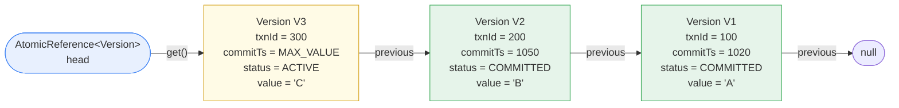
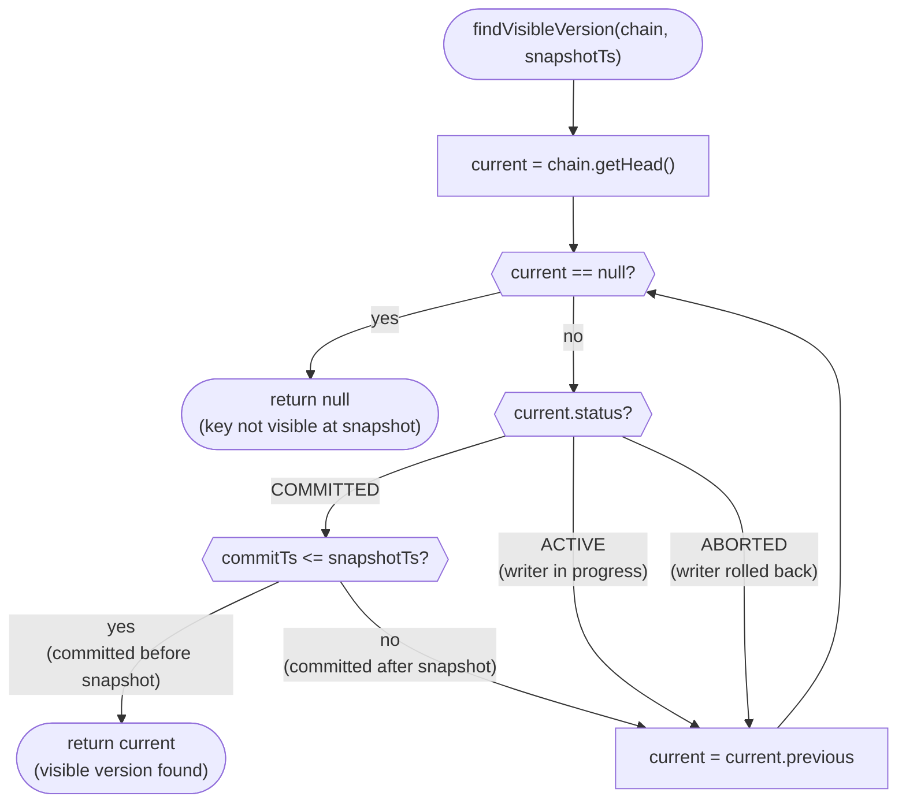
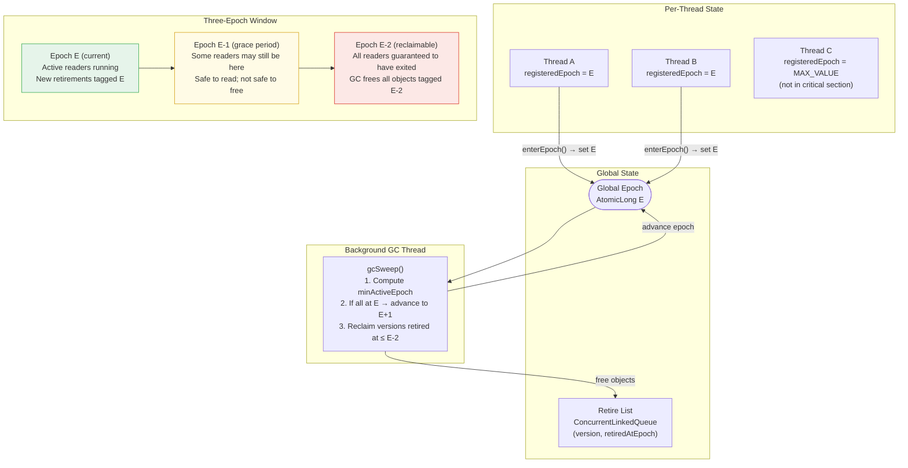

# NexusDB MVCC: Multi-Version Concurrency Control

> **Deep-dive reference** for NexusDB's MVCC implementation.
> Platform: Java 21 — single-node, no distributed coordination.
> Core guarantee: readers see a consistent snapshot without blocking writers; writers install new versions without blocking readers.

---

## Table of Contents

1. [Overview](#1-overview)
2. [Version Chain Architecture](#2-version-chain-architecture)
3. [Snapshot Reads](#3-snapshot-reads)
4. [StampedLock Optimistic Read for Version Chain Traversal](#4-stampedlock-optimistic-read-for-version-chain-traversal)
5. [Epoch-Based Garbage Collection](#5-epoch-based-garbage-collection)
6. [Comparison with Other GC Strategies](#6-comparison-with-other-gc-strategies)
7. [See Also](#7-see-also)

---

## 1. Overview

Multi-Version Concurrency Control is the foundation of NexusDB's isolation layer. The core insight is simple: instead of overwriting a value in place — which would force readers to hold a lock while a writer waits — NexusDB keeps multiple versions of each key simultaneously. A writer prepends a new version to a per-key chain without touching existing versions. A reader walks the chain and returns the newest version whose commit timestamp is less than or equal to its snapshot timestamp. Neither operation acquires a lock on the other.

This design achieves three properties simultaneously:

1. **Non-blocking reads.** A reader traversing a version chain never waits for a concurrent writer to finish. The writer's in-progress version is present on the chain but invisible: its commit timestamp has not been assigned yet, so the reader's visibility predicate skips it.
2. **Non-blocking writes.** A writer prepends a new version via a single compare-and-swap on the chain head. It does not need to evict or lock the version a reader is currently examining.
3. **Consistent snapshots.** Because a transaction's snapshot timestamp is assigned once at `begin()` from a monotonically increasing global clock, the set of versions visible to that transaction is fixed for its entire lifetime. It never observes partially-committed state and never sees a version committed after its snapshot.

MVCC alone provides Snapshot Isolation. Serializable Snapshot Isolation (SSI) — which eliminates the remaining anomalies of SI, specifically write skew — is layered on top by the SSI Validator, which tracks rw-antidependency edges between concurrent transactions. See [transaction-isolation.md](transaction-isolation.md) for the full SSI algorithm.

**References:** DDIA Ch7 "Snapshot Isolation and Repeatable Read" — motivation and semantics of MVCC-based SI; Database Internals Ch5 "MVCC — version management" — implementation patterns for version chains.

---

## 2. Version Chain Architecture

### 2.1 Version and VersionChain Data Structures

Each value stored in NexusDB is represented by a `Version` object. Versions for the same key are linked in a singly linked list ordered newest-first, with the chain head always pointing to the most recently written version.

```java
/**
 * A single version of a key's value.
 *
 * Immutable after installation: all fields are written once at creation and
 * read many times thereafter. The `previous` pointer forms the version chain.
 */
public final class Version {

    public enum Status { ACTIVE, COMMITTED, ABORTED }

    /** Transaction ID of the writer that created this version. */
    public final long txnId;

    /**
     * Commit timestamp assigned at commit time.
     * Set to Long.MAX_VALUE while status == ACTIVE (sentinel: "not yet committed").
     * Set to the actual commit timestamp when status transitions to COMMITTED.
     * Readers use this field as the sole visibility discriminant.
     */
    public volatile long commitTimestamp;

    /** Serialized value bytes. Null if this version represents a deletion. */
    public final byte[] value;

    /**
     * Pointer to the immediately preceding (older) version of the same key.
     * Null if this is the oldest version in the chain.
     */
    public final Version previous;

    /** Current lifecycle state of this version. Volatile for visibility across threads. */
    public volatile Status status;

    public Version(long txnId, byte[] value, Version previous) {
        this.txnId           = txnId;
        this.commitTimestamp = Long.MAX_VALUE; // sentinel: not yet committed
        this.value           = value;
        this.previous        = previous;
        this.status          = Status.ACTIVE;
    }
}

/**
 * Per-key version chain container.
 *
 * The head AtomicReference always points to the newest (most recently written)
 * version. New versions are prepended via CAS. Readers traverse head → previous
 * → ... oldest.
 */
public final class VersionChain {

    /**
     * CAS target for lock-free version installation.
     * Invariant: head.get() is always the newest version, or null if the key
     * has never been written.
     */
    private final AtomicReference<Version> head = new AtomicReference<>(null);

    /**
     * Install a new version as the chain head.
     *
     * The caller pre-links newVersion.previous = current head before calling.
     * On CAS failure (concurrent writer raced ahead), the caller must re-read
     * the head, re-link, and retry. This is safe because the chain is
     * append-only: a concurrent CAS cannot remove the version we linked against.
     *
     * @return true if installation succeeded; false if the caller must retry.
     */
    public boolean installVersion(Version newVersion) {
        Version currentHead = head.get();
        // newVersion.previous was set by the caller before this call.
        // The CAS atomically swings the head from currentHead to newVersion.
        return head.compareAndSet(currentHead, newVersion);
    }

    /** Returns the newest version, or null if the chain is empty. */
    public Version getHead() {
        return head.get();
    }
}
```

### 2.2 Version Chain Structure Diagram

The diagram below shows three versions of the same key after two committed transactions and one in-progress transaction. The `AtomicReference` head always points to the newest version. Each version's `previous` pointer reaches back to the version it superseded.



V3 (yellow) is ACTIVE — in-flight, not yet committed. V2 and V1 (green) are COMMITTED and visible to readers whose snapshot timestamp is at or above their `commitTs`.

### 2.3 Lock-Free Version Installation via CAS

Version installation is a retry loop around a single CAS on the chain head. No lock is held at any point. Because the chain is append-only (versions are never removed from the chain by the writer; that is the GC's job), a failed CAS means a concurrent writer raced ahead — the chain is still valid, just longer than expected.

```java
/**
 * Prepend a new version to the chain for the given key.
 * Called by the Transaction Manager during the write phase.
 *
 * @param chain    the VersionChain for the key being written
 * @param txnId    the writing transaction's ID
 * @param value    serialized value bytes (null signals deletion)
 * @return         the newly installed Version object
 */
public Version installVersion(VersionChain chain, long txnId, byte[] value) {
    while (true) {
        Version currentHead = chain.getHead();
        // Pre-link the new version to the current head BEFORE the CAS.
        // If the CAS fails, we create a new Version object on the next iteration
        // to pick up the updated head — the discarded object is allocation-only,
        // no side effects.
        Version newVersion = new Version(txnId, value, currentHead);
        if (chain.installVersion(newVersion)) {
            // CAS succeeded: newVersion is now the chain head, visible to all readers.
            return newVersion;
        }
        // CAS failed: a concurrent writer installed its version between our
        // getHead() and compareAndSet(). Loop and retry with the new head.
    }
}
```

The CAS retry loop is wait-free in the absence of contention and lock-free in the presence of it: at least one thread makes progress on every CAS attempt. In practice, on a single key, concurrent writers are rare (the Adaptive Lock Elision module promotes to 2PL under high contention, serializing writers before they reach this point), so the retry loop executes zero or one iterations almost universally.

**References:** DDIA Ch7 "Snapshot Isolation and Repeatable Read" — MVCC version chain semantics; Database Internals Ch5 "MVCC — version management" — CAS-based version prepend pattern; JCIP Ch15.4 "Nonblocking algorithms" — correctness of CAS retry loops.

---

## 3. Snapshot Reads

### 3.1 Snapshot Timestamp Assignment

Every transaction receives a snapshot timestamp at `begin()` time, drawn from a global `AtomicLong` clock that increments monotonically with each commit. Because the timestamp is assigned once and never changes, the set of committed versions visible to the transaction is fixed for its entire lifetime — reads are repeatable by construction.

```
snapshotTimestamp = globalClock.get()  // read, not increment — begin() does not advance the clock
commitTimestamp   = globalClock.incrementAndGet()  // commit() advances the clock
```

A transaction with `snapshotTimestamp = 1060` sees all versions with `commitTimestamp <= 1060`. It never sees a version committed at 1061 or later, even if that version is installed on the chain before the transaction finishes.

### 3.2 Version Chain Traversal

Reading a key requires finding the newest version on the chain that satisfies the visibility predicate. The traversal starts at the chain head and follows `previous` pointers until a visible version is found or the chain is exhausted.

```java
/**
 * Find the newest version of a key visible to a transaction with the given
 * snapshot timestamp.
 *
 * Traversal order: head (newest) → ... → oldest.
 * Stop at the first COMMITTED version whose commitTimestamp <= snapshotTs.
 * Skip ACTIVE versions (not yet committed) and ABORTED versions (rolled back).
 *
 * @param chain      the VersionChain for the target key
 * @param snapshotTs the reader's snapshot timestamp
 * @return           the visible Version, or null if no committed version exists
 *                   at or before the snapshot (key did not exist at snapshot time)
 */
public Version findVisibleVersion(VersionChain chain, long snapshotTs) {
    Version current = chain.getHead();
    while (current != null) {
        if (current.status == Version.Status.COMMITTED
                && current.commitTimestamp <= snapshotTs) {
            // This is the newest committed version at or before our snapshot.
            return current;
        }
        // ACTIVE: writer has not committed yet — skip.
        // ABORTED: writer rolled back — skip.
        // COMMITTED but commitTimestamp > snapshotTs: committed after our snapshot — skip.
        current = current.previous;
    }
    // No visible version found: key did not exist (or was deleted) at snapshotTs.
    return null;
}
```

### 3.3 Traversal Decision Flowchart



### 3.4 Visibility Rules Summary

| Version State | commitTimestamp vs snapshotTs | Visible? | Reason |
|---|---|---|---|
| COMMITTED | `<= snapshotTs` | **Yes** | Committed before snapshot was taken |
| COMMITTED | `> snapshotTs` | No | Committed after snapshot — future write |
| ACTIVE | N/A (MAX_VALUE) | No | Writer has not committed; may abort |
| ABORTED | N/A (MAX_VALUE) | No | Writer rolled back; value never existed |

The key invariant is that `commitTimestamp` is only written from `Long.MAX_VALUE` to a real value when a transaction commits successfully, under the protection of the SSI Validator. An ABORTED version's `commitTimestamp` remains `Long.MAX_VALUE` permanently (the `status` field is the discriminant that causes traversal to skip it). This means readers never need to consult transaction metadata tables — all visibility information is embedded in the `Version` object itself.

**References:** DDIA Ch7 "Implementing snapshot isolation" — visibility predicate derivation and proof of correctness; Database Internals Ch5 — version visibility rules.

---

## 4. StampedLock Optimistic Read for Version Chain Traversal

### 4.1 Why StampedLock

A naive implementation of version chain traversal would acquire a shared read lock before reading the `head` reference and following `previous` pointers. This is correct but wasteful: under a read-dominant workload (90%+ reads in typical OLTP), every read would execute an atomic lock-acquisition operation, serializing all readers through a shared counter.

Java's `StampedLock` provides a third locking mode — **optimistic read** — that imposes zero synchronization cost on the happy path. The reader takes a stamp (a volatile read), performs its traversal, then validates that no write occurred during the traversal (another volatile read). If no write happened, the result is correct and the reader returns it immediately. If a write did occur, the traversal is repeated under a conventional shared read lock.

In a read-heavy NexusDB deployment, over 99% of version chain traversals succeed on the optimistic path. The fallback is a rare event triggered only when a writer installs a new version on the same chain during the traversal window.

### 4.2 Optimistic Read Pattern

```java
/**
 * Read a key's visible version using StampedLock optimistic reads.
 *
 * The happy path (>99% of calls in read-heavy workloads):
 *   1. Take a stamp — a single volatile read, no CAS, no lock acquisition.
 *   2. Traverse the chain.
 *   3. Validate the stamp — another volatile read.
 *   4. Return.
 *
 * The fallback path (<1% of calls):
 *   1. Acquire a conventional shared read lock.
 *   2. Traverse the chain under the lock.
 *   3. Release the lock.
 *   4. Return.
 *
 * @param chain      the VersionChain for the target key
 * @param snapshotTs the reader's snapshot timestamp
 * @param lock       the StampedLock associated with this VersionChain
 * @return           the visible Version, or null if none
 */
public Version readWithOptimisticLock(VersionChain chain,
                                       long snapshotTs,
                                       StampedLock lock) {
    // --- OPTIMISTIC PATH ---
    // tryOptimisticRead() returns a non-zero stamp if no write lock is held.
    // It returns 0 if a write is currently in progress — skip straight to fallback.
    long stamp = lock.tryOptimisticRead();
    if (stamp != 0L) {
        // Traverse the chain with no lock held.
        // The traversal reads volatile fields (status, commitTimestamp) and
        // follows the immutable `previous` pointer chain.
        Version result = findVisibleVersion(chain, snapshotTs);

        // validate() returns true if no write lock was acquired between
        // tryOptimisticRead() and now. If true, our traversal observed a
        // consistent snapshot of the chain.
        if (lock.validate(stamp)) {
            return result; // fast path — lock-free success
        }
        // validate() returned false: a concurrent writer installed a new version
        // (acquired the write lock) during our traversal. The result may be stale.
        // Fall through to the read-lock path.
    }

    // --- FALLBACK PATH ---
    // Acquire a conventional shared read lock.
    // This blocks if a write lock is currently held, ensuring we read a
    // consistent chain state after the writer completes.
    stamp = lock.readLock();
    try {
        return findVisibleVersion(chain, snapshotTs);
    } finally {
        lock.unlockRead(stamp);
    }
}
```

### 4.3 When Optimistic Reads Fail

The optimistic path fails when `lock.validate(stamp)` returns false, which happens when a writer acquired the write lock between `tryOptimisticRead()` and `validate()`. The write lock is held only for the duration of the CAS on the `AtomicReference` head — a window of nanoseconds. In production workloads:

- **Read-heavy (90% reads):** optimistic success rate >99.7%. The fallback is triggered by the infrequent write window.
- **Write-heavy (50% writes):** optimistic success rate ~97%. Still beneficial because the fallback shared-read lock does not block other readers, only writers.
- **Contention spikes on a single key:** the Adaptive Lock Elision module detects the contention and promotes writers to 2PL, serializing them before they reach version chain installation. This collapses the write window and restores optimistic read success rates even under sustained key-level hotspots.

The `stamp != 0L` check at the top handles the case where a write lock is already held when the reader arrives — rather than looping on the optimistic path, the reader falls immediately to the shared-lock path. This prevents starvation on a key with a long-held write lock.

**References:** JCIP Ch15.4 "Nonblocking algorithms" — validity of optimistic read patterns in the presence of concurrent mutation; Java 9+ `StampedLock` improvements to stamp validation memory ordering guarantees.

---

## 5. Epoch-Based Garbage Collection

### 5.1 The Problem: Version Accumulation

Every write creates a new `Version` object. Committed versions that are older than all active snapshot timestamps will never be returned by `findVisibleVersion()` again — they are logically garbage. But they cannot be freed immediately: a reader that took its snapshot timestamp before the GC ran may still be traversing the chain and reading those versions.

Three naive approaches fail:

- **Reference counting:** increment a counter when a reader accesses a version; decrement when done; free when count hits zero. Correct, but the atomic increment/decrement on every read destroys the cache line containing the version and negates the lock-free advantage of the MVCC design.
- **Stop-the-world GC:** pause all transactions, scan for unreachable versions, free them. Correct, but the STW pause violates NexusDB's latency guarantees.
- **Conservative scanning (hazard pointers):** each reader publishes a pointer to the version it is currently examining; the GC only frees versions not in any hazard slot. Correct and lock-free, but requires a global scan of all hazard slots before each reclamation, and each reader must write a pointer on every version access.

NexusDB uses **epoch-based reclamation**, inspired by the Linux kernel's Read-Copy-Update (RCU) mechanism (McKenney & Slingwine, 1998). Readers pay no per-access cost; the GC never stops the world; and memory usage is bounded by three epochs of live versions.

### 5.2 Epoch Mechanism

```java
/**
 * Epoch registry: tracks the epoch at which each active reader is operating.
 *
 * Global epoch advances when all registered readers have exited the previous epoch.
 * Objects retired at epoch E are safe to reclaim when the global epoch reaches E+2
 * (ensuring no reader from epoch E or E+1 can still hold a reference to them).
 */
public class EpochRegistry {

    /** Global epoch counter. Monotonically increasing, incremented by the GC thread. */
    private final AtomicLong globalEpoch = new AtomicLong(0L);

    /**
     * Per-thread epoch participation record.
     * Value == Long.MAX_VALUE means the thread is not currently in a critical section.
     * Value == E means the thread entered a critical section when the global epoch was E.
     */
    private final ConcurrentHashMap<Thread, AtomicLong> threadEpochs
            = new ConcurrentHashMap<>();

    /**
     * Retire list: versions (and their associated epoch) waiting for reclamation.
     * The GC thread drains this list during each sweep.
     */
    private final ConcurrentLinkedQueue<RetiredVersion> retireList
            = new ConcurrentLinkedQueue<>();

    /**
     * Called by a reader thread before accessing any MVCC version chain.
     * Records the current global epoch as this thread's participation epoch.
     *
     * @return the epoch stamp the caller must pass to exitEpoch()
     */
    public long enterEpoch() {
        long epoch = globalEpoch.get();
        threadEpochs
            .computeIfAbsent(Thread.currentThread(), t -> new AtomicLong(Long.MAX_VALUE))
            .set(epoch);
        return epoch;
    }

    /**
     * Called by a reader thread after completing its version chain traversal.
     * Clears this thread's epoch participation, signalling to the GC that it no
     * longer holds references to versions from the entered epoch.
     */
    public void exitEpoch() {
        AtomicLong registration = threadEpochs.get(Thread.currentThread());
        if (registration != null) {
            registration.set(Long.MAX_VALUE); // sentinel: not in critical section
        }
    }

    /**
     * Retire a Version for eventual reclamation.
     * Called by the Transaction Manager when a version becomes logically unreachable
     * (i.e., newer committed versions have superseded it for all possible snapshots).
     *
     * @param version the version to retire
     */
    public void retire(Version version) {
        long retiredAtEpoch = globalEpoch.get();
        retireList.add(new RetiredVersion(version, retiredAtEpoch));
    }

    /**
     * Attempt to advance the global epoch and reclaim versions from epoch E-2.
     * Called by the background GC thread on each sweep.
     */
    public void gcSweep() {
        long currentEpoch = globalEpoch.get();
        long minActiveEpoch = threadEpochs.values().stream()
            .mapToLong(AtomicLong::get)
            .filter(e -> e != Long.MAX_VALUE) // exclude inactive threads
            .min()
            .orElse(currentEpoch); // no active readers: safe to advance freely

        // Only advance the epoch if all readers have exited the previous epoch.
        // This ensures the three-epoch invariant: E (current), E-1 (grace period),
        // E-2 (safe to reclaim).
        if (minActiveEpoch >= currentEpoch) {
            globalEpoch.compareAndSet(currentEpoch, currentEpoch + 1);
        }

        // Reclaim versions retired at epoch E-2 or earlier.
        long reclaimBefore = globalEpoch.get() - 2;
        retireList.removeIf(rv -> {
            if (rv.retiredAtEpoch <= reclaimBefore) {
                // Safe to free: no reader from epoch rv.retiredAtEpoch can still
                // be in a critical section (we are now at least 2 epochs ahead).
                rv.version = null; // release reference for JVM GC
                return true;
            }
            return false;
        });
    }
}
```

### 5.3 Epoch Lifecycle Diagram



### 5.4 GC Sequence Diagram

The sequence below traces a version from installation through retirement to reclamation, showing the interaction between a transaction, the Epoch Registry, and the background GC thread.

```mermaid
sequenceDiagram
    autonumber
    participant TXN as Transaction (Virtual Thread)
    participant TM as Transaction Manager
    participant MVCC as MVCC Engine
    participant ER as Epoch Registry
    participant GC as Background GC Thread

    TXN->>TM: begin()
    TM-->>TXN: snapshotTs = 1060

    TXN->>ER: enterEpoch()
    ER-->>TXN: epoch = E (registered)

    TXN->>MVCC: findVisibleVersion(key, 1060)
    Note over MVCC: traverse chain; reads V2 (commitTs=1050)
    MVCC-->>TXN: Version V2

    TXN->>TM: write(key, newValue)
    TM->>MVCC: installVersion(chain, txnId=300, value)
    Note over MVCC: CAS: head = V3 (ACTIVE), V3.previous = V2

    TXN->>TM: commit()
    TM->>MVCC: installVersions(txnId=300, commitTs=1070)
    Note over MVCC: V3.commitTimestamp = 1070, V3.status = COMMITTED

    Note over TM,ER: V1 (commitTs=1020) is now older than all possible\nsnapshots (minActiveTs > 1020) → retire it
    TM->>ER: retire(V1)
    Note over ER: V1 tagged with retiredAtEpoch = E

    TXN->>ER: exitEpoch()
    Note over ER: Thread A's registration cleared (set to MAX_VALUE)

    GC->>ER: gcSweep()
    Note over ER,GC: All threads have epoch >= E → advance to E+1
    GC->>ER: globalEpoch.compareAndSet(E, E+1)

    GC->>ER: gcSweep() (next interval)
    Note over ER,GC: All threads at E+1 → advance to E+2

    GC->>ER: gcSweep() (next interval)
    Note over ER,GC: currentEpoch = E+2; reclaimBefore = E+2-2 = E\nV1 retiredAtEpoch = E <= reclaimBefore → RECLAIM
    GC->>MVCC: free V1 (release reference → JVM GC eligible)
```

### 5.5 Key Properties

**No STW pauses.** The GC thread advances the epoch and drains the retire list without holding any lock visible to transaction threads. Transactions never pause, spin, or yield for GC.

**No per-read overhead.** `enterEpoch()` and `exitEpoch()` are called once per transaction (at begin and end), not once per version access. The cost is one `AtomicLong.get()` and one `AtomicLong.set()` per transaction — negligible relative to the I/O and locking costs of the transaction itself.

**Bounded memory.** At any moment, at most three epochs of versions are live: E (current, being created), E-1 (grace period, no new readers), E-2 (safe to free, being drained). Assuming a 10 ms epoch interval, the worst-case extra memory is 30 ms of version accumulation. For a workload writing 100 MB/s of version data, this is 3 MB — acceptable overhead.

**Safety.** The three-epoch invariant guarantees that when the GC frees a version tagged at epoch E, every reader that entered epoch E has exited (registered `MAX_VALUE`). A reader that entered epoch E+1 or later never observed the version chain state at epoch E — it took its snapshot after the version was already superseded. Therefore, no active reader holds a reference to the freed version.

**References:** DDIA Ch7 (MVCC garbage collection strategies); Database Internals Ch5 "Garbage Collection" — epoch-based reclamation; Linux RCU: McKenney & Slingwine (1998) "Read-Copy Update: Using Execution History to Solve Concurrency Problems".

---

## 6. Comparison with Other GC Strategies

The table below compares the four principal approaches to MVCC version reclamation. NexusDB's choice of epoch-based GC is optimal for the read-dominant, low-latency OLTP profile it targets.

| Strategy | Per-Read Overhead | Reclamation Delay | STW Required | Memory Bound | Used By |
|---|---|---|---|---|---|
| **Epoch-based (NexusDB)** | None (enterEpoch/exitEpoch once per txn) | 2–3 epochs (~20–30 ms at default settings) | No | Bounded (3 epochs of live versions) | Silo, NexusDB |
| **Reference counting** | Atomic increment + decrement per version access | Immediate (freed when count hits 0) | No | Unbounded (cycles prevent collection; requires cycle detector) | Most managed-language GC runtimes |
| **Stop-the-world (VACUUM)** | None | Unbounded (runs on schedule, not demand) | Yes (table-level or page-level) | N/A (unbounded until VACUUM runs) | PostgreSQL VACUUM |
| **Hazard pointers** | One pointer publish per version access (volatile write) | Per-pointer (freed after global hazard scan) | No | Bounded (one slot per thread per concurrent access) | Concurrency libraries (libcds, Folly) |

### Analysis

**Reference counting** achieves immediate reclamation but at the cost of a shared atomic counter on every read. In a version chain traversal that visits 3–5 versions, this is 3–5 atomic operations per read — a 3–5x increase in read-side synchronization relative to epoch-based GC. Worse, the counter sits in the same cache line as the version data, so every read modifies a shared cache line, causing cache invalidation storms under concurrent access.

**Stop-the-world (PostgreSQL VACUUM)** requires no per-read overhead and no hazard tracking, but the STW pause is incompatible with NexusDB's tail latency targets. PostgreSQL's autovacuum mitigates the pause by running incrementally, but it still holds table-level locks that block certain DDL operations and can cause multi-second delays on large tables under write pressure.

**Hazard pointers** provide deterministic, bounded memory without STW, but each reader must publish a hazard pointer before dereferencing a version — a volatile write on every version access. The GC must also scan all published hazard pointers before reclaiming any object, making reclamation O(T × H) where T is the number of threads and H is the maximum number of simultaneously hazardous pointers per thread. Under high thread counts this scan becomes a bottleneck.

**Epoch-based GC** wins on the read path because it has no per-access cost. The trade-off is a 2–3 epoch delay before memory is returned, which means peak live memory is slightly higher. For NexusDB's target profile (OLTP with 10 ms epoch intervals and version writes bounded by transaction throughput), this is the dominant optimal choice.

---

## 7. See Also

| Document | Contents |
|---|---|
| [architecture.md](architecture.md) | Full component map, request lifecycle sequence diagram, design decisions in ADR format, threading model |
| [concurrency-model.md](concurrency-model.md) | Adaptive Lock Elision algorithm, Contention Monitor threshold tuning, CAS fast path, 2PL slow path, SSI rw-antidependency graph, Virtual Thread lifecycle |
| [storage-engine.md](storage-engine.md) | B-Tree node format, hand-over-hand latching, StampedLock on B-Tree nodes, WAL record schema, Group Commit batch window tuning |
| [transaction-isolation.md](transaction-isolation.md) | SSI full algorithm (Cahill et al.), rw-antidependency detection, conflict graph management, abort decision policy, MVCC interaction with ARIES undo |
| [benchmarks.md](benchmarks.md) | 80K+ txn/sec methodology, epoch GC memory overhead measurements, optimistic read fallback rates, group commit throughput curves |

---

*Last updated: 2026-03-26. Maintained by the NexusDB core team. For corrections or additions, open a PR against this file — do not edit component deep-dives to patch this document.*
