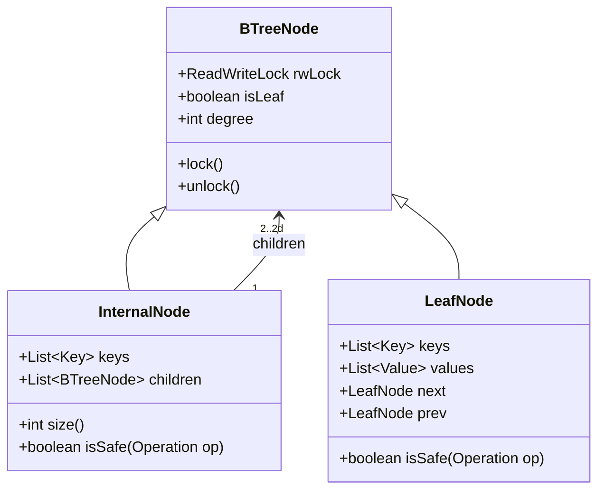
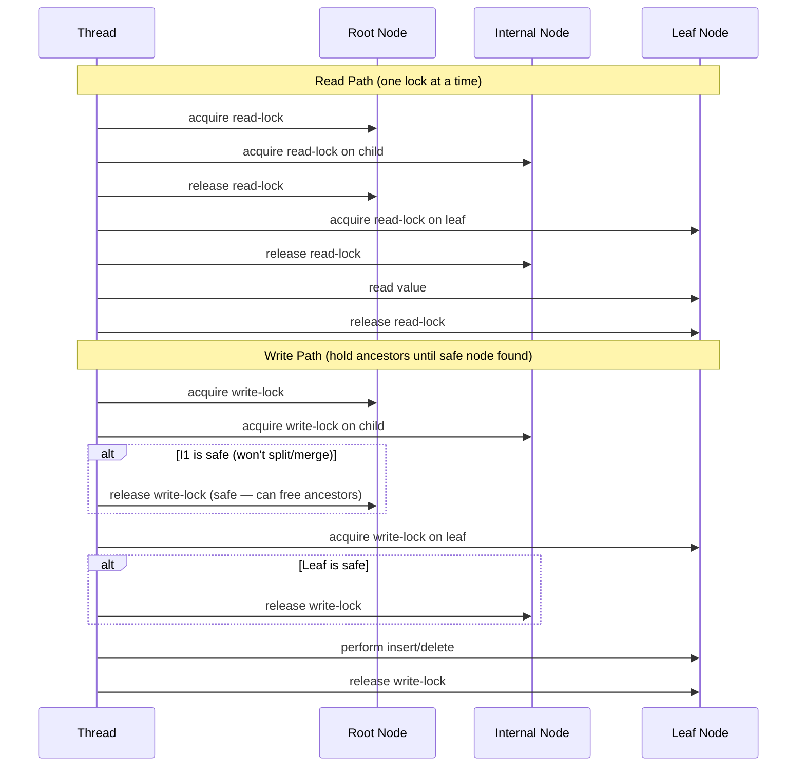
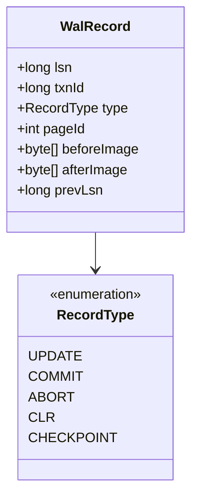
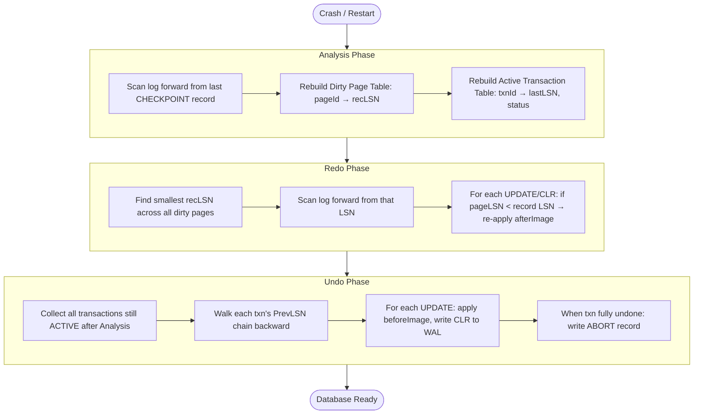
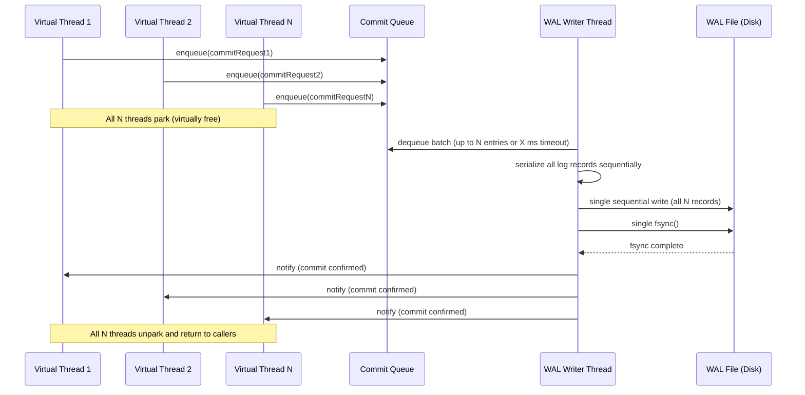

# NexusDB Storage Engine

> **Audience**: Staff-level engineers evaluating NexusDB internals or contributing to the storage layer.
> **Scope**: Single-node Java 21 storage engine — durable, indexed access with crash recovery.

---

## 1. Overview

The NexusDB storage engine provides three guarantees:

1. **Durability** — committed transactions survive process crashes and power failures.
2. **Indexed access** — sub-linear point and range queries via a concurrent B-Tree.
3. **Crash recovery** — the database reaches a consistent state after any failure without manual intervention.

The engine is built on three interlocking subsystems:

| Subsystem | Responsibility |
|---|---|
| Concurrent B-Tree | In-memory index with lock-safe structural modifications |
| Write-Ahead Log (WAL) | ARIES-style redo/undo log for durability and recovery |
| Group Commit Pipeline | Batches WAL flushes across many concurrent virtual-thread transactions |

All three subsystems are implemented in Java 21. The engine exploits virtual threads (JEP 444) heavily: transactions run as lightweight virtual threads that park cheaply on I/O and synchronization primitives without consuming OS threads.

---

## 2. Concurrent B-Tree Index

### 2.1 Design Goals

| Goal | Mechanism |
|---|---|
| Lock-free readers | Readers hold only a single read-lock at a time (released before descending) |
| Safe structural modifications | Writers hold write-locks on the entire modification path until a "safe" ancestor is found |
| Bounded lock contention | Hand-over-hand (crabbing) protocol limits the lock window to O(tree height) nodes |

The tree never holds a global latch. All concurrency control is local to individual nodes.

### 2.2 Node Structure

Each node carries its own `ReadWriteLock`. Internal nodes store separator keys and child pointers. Leaf nodes store key-value pairs and are linked in a doubly-linked list for efficient range scans.



A node is **safe** with respect to an operation if the operation will not cause a structural change (split or merge) at that node:
- **Insert**: safe if `node.size() < 2d - 1` (has room before hitting max capacity).
- **Delete**: safe if `node.size() > d` (has surplus before hitting min capacity).

### 2.3 Hand-Over-Hand (Crabbing) Protocol

The crabbing protocol ensures readers never block one another and writers only hold the minimal set of locks needed to protect a structural modification.



Key invariant: if a node is safe, all its ancestors are also safe for this operation — so all ancestor write-locks can be released. This bounds worst-case lock holding to a path from root to a single safe ancestor.

### 2.4 Hand-Over-Hand Traversal — Java Implementation

```java
/**
 * Hand-over-hand (crabbing) B-Tree traversal.
 *
 * <p>Read path: hold exactly one read-lock at a time.
 * Write path: accumulate write-locks from root until a safe node is found,
 * then release all ancestor locks above it.
 */
private BTreeNode crabTo(Key key, Operation op) {
    Deque<BTreeNode> lockedAncestors = new ArrayDeque<>();

    BTreeNode current = root;
    if (op == Operation.READ) {
        current.rwLock.readLock().lock();
    } else {
        current.rwLock.writeLock().lock();
        lockedAncestors.push(current);
    }

    while (!current.isLeaf()) {
        BTreeNode child = ((InternalNode) current).findChild(key);

        if (op == Operation.READ) {
            child.rwLock.readLock().lock();
            current.rwLock.readLock().unlock();   // release parent immediately
        } else {
            child.rwLock.writeLock().lock();
            lockedAncestors.push(child);
            if (child.isSafe(op)) {
                // Safe node found: release all ancestors above this child.
                // Work from bottom of stack upward, stopping before child itself.
                BTreeNode top;
                while ((top = lockedAncestors.peek()) != child) {
                    lockedAncestors.pop().rwLock.writeLock().unlock();
                }
            }
        }
        current = child;
    }
    // Caller owns all locks remaining in lockedAncestors (write path)
    // or the single read-lock on current (read path).
    return current;
}
```

### 2.5 Node Split and Merge — SMO Safety

A Structure Modification Operation (SMO) changes the tree's shape. Splits and merges must appear atomic: no reader or writer should observe an intermediate half-split state.

**Split protocol (bottom-up, under write-locks):**

1. The inserting thread holds write-locks on all nodes from the root down to the leaf (or from the last safe ancestor down — see §2.3).
2. The leaf is split: a new sibling leaf is allocated, half the keys are moved, and the sibling is linked into the leaf linked-list.
3. The separator key is inserted into the parent (which is already write-locked).
4. If the parent overflows, it is split in turn — recursively upward — all under the locks already held.
5. All write-locks are released in leaf-to-root order after the SMO completes.

No reader can observe a partially split node because the read-lock on each node is only grantable after the write-lock is released (standard `ReentrantReadWriteLock` semantics).

**Merge protocol** is symmetric: the thread holds write-locks on both the underflowing node and its sibling before transferring keys or collapsing the sibling.

**References**:
- *Database Internals* Ch4 "Implementing B-Trees", Ch5 "B-Tree Variants — latch coupling"
- *Designing Data-Intensive Applications* (DDIA) Ch3 "B-Trees"

---

## 3. Write-Ahead Log (WAL)

### 3.1 WAL Record Format

NexusDB uses an ARIES-style WAL. Every modification is logged before it is applied to the page. Each log record has the following structure:



| Field | Purpose |
|---|---|
| `lsn` | Log Sequence Number — monotonically increasing, uniquely identifies this record |
| `txnId` | Transaction that generated this record |
| `type` | Operation class (see `RecordType`) |
| `pageId` | The data page this record modifies (`-1` for non-page records) |
| `beforeImage` | Page bytes before the change — used during undo |
| `afterImage` | Page bytes after the change — used during redo |
| `prevLsn` | LSN of the previous record from the same transaction — forms a per-transaction undo chain |

### 3.2 WAL Record — Java Implementation

```java
/**
 * Immutable WAL record.
 *
 * <p>Serialized to disk as:
 * [lsn:8][txnId:8][type:1][pageId:4][prevLsn:8]
 * [beforeLen:4][beforeImage:beforeLen][afterLen:4][afterImage:afterLen]
 */
public record WalRecord(
    long lsn,
    long txnId,
    RecordType type,
    int pageId,
    byte[] beforeImage,
    byte[] afterImage,
    long prevLsn
) {
    public enum RecordType { UPDATE, COMMIT, ABORT, CLR, CHECKPOINT }

    /** True for records that carry page modifications. */
    public boolean isPhysical() {
        return type == RecordType.UPDATE || type == RecordType.CLR;
    }

    /**
     * Compensation Log Record for undoing {@code original}.
     * The CLR's afterImage is the original record's beforeImage —
     * restoring the page to its pre-{@code original} state.
     */
    public static WalRecord clrFor(WalRecord original, long newLsn, long undoNextLsn) {
        return new WalRecord(
            newLsn,
            original.txnId(),
            RecordType.CLR,
            original.pageId(),
            original.afterImage(),  // before = state we're undoing from
            original.beforeImage(), // after  = state we're restoring to
            undoNextLsn             // prevLsn in CLR points to next record to undo
        );
    }
}
```

### 3.3 The Three ARIES Principles

**Principle 1 — Write-Ahead Logging (WAL)**
Before a dirty page is written to disk, all WAL records up to and including that page's `pageLSN` must be flushed to the log. This ensures redo information is always available on disk before the modified page.

**Principle 2 — Repeating History During Redo**
During recovery, ARIES re-applies every logged action — even those belonging to transactions that ultimately aborted. This restores the database to the exact state it was in at the moment of crash, before the undo phase rolls back uncommitted transactions.

**Principle 3 — Logging Changes During Undo**
Every undo action is itself logged as a Compensation Log Record (CLR). If the system crashes again during undo, the CLRs allow recovery to skip already-undone operations — making undo idempotent.

### 3.4 Recovery Protocol



**Analysis phase** reconstructs, from the last checkpoint forward, exactly which pages were dirty and which transactions were in-flight at crash time. It does not touch data pages.

**Redo phase** replays every logged action starting from the earliest `recLSN` in the dirty page table. Because ARIES repeats history, aborted transactions are also redone here — their undo happens next.

**Undo phase** walks each active transaction's `PrevLSN` chain in reverse LSN order and reverts each update using its `beforeImage`. Each undo step produces a CLR so that if the system crashes again during undo, already-undone work is not repeated.

### 3.5 CLR — Compensation Log Records

A CLR is written for every undo step. Its `afterImage` is the `beforeImage` of the original update — so applying the CLR restores the page to the state before the original update. The CLR's `prevLsn` (also called `undoNextLSN`) points to the next record in the same transaction that must be undone, skipping the CLR itself. This chain skipping makes repeated crashes during undo safe.

```
Normal log chain:   ... → [LSN=10, UPDATE] → [LSN=20, UPDATE] → [LSN=30, UPDATE]
After partial undo: ... → [LSN=10, UPDATE] → [LSN=20, UPDATE] → [LSN=40, CLR(undoNext=10)]
Re-crash resumes:   Undo resumes at LSN=10 (pointed to by CLR's undoNextLSN), skips LSN=20/30.
```

### 3.6 LSN Mechanics

| Variable | Location | Meaning |
|---|---|---|
| `pageLSN` | Each page header | LSN of the last WAL record that modified this page |
| `flushedLSN` | In-memory WAL manager | Highest LSN that has been flushed (fsync'd) to the log file |
| `recLSN` | Dirty page table entry | LSN of the first WAL record that dirtied this page since last flush |

The WAL rule expressed as an invariant: `pageLSN ≤ flushedLSN` must hold before any dirty page is written to the data file.

**References**:
- *Database Internals* Ch3 "Recovery — ARIES"
- *DDIA* Ch7 "Durability — WAL discussion"

---

## 4. Group Commit with Virtual Threads

### 4.1 Problem: Per-Transaction fsync

A naive durability implementation calls `fsync` on the WAL file once per committed transaction. On modern hardware, a single `fsync` takes 1–10 ms. At 1 ms per fsync, the maximum throughput is 1,000 commits/second regardless of CPU or memory speed. This is a well-known bottleneck described in DDIA Ch7.

### 4.2 Solution: Group Commit Pipeline



The WAL writer thread is the only thread that touches the log file. It dequeues a batch, serializes all log records into a single contiguous buffer, issues one `write`, and one `fsync`. All N waiting virtual threads are then notified simultaneously.

### 4.3 Why Virtual Threads

Java 21 virtual threads (JEP 444) are the key enabler:

| Property | OS Thread | Virtual Thread |
|---|---|---|
| Stack size | ~1 MB (default) | ~1 KB (grows on demand) |
| Park cost | OS context switch | In-heap pointer swap |
| Thread pool sizing | Required (fixed pool) | Not needed — create thousands |
| Code style | Async callbacks or reactive | Blocking — natural and debuggable |

Each transaction runs as a virtual thread. When it enqueues its commit request and waits for the WAL writer to confirm, it parks. Parking a virtual thread is a heap operation — the virtual thread's stack is simply detached from its carrier OS thread. The carrier OS thread is immediately available to run other virtual threads.

This means 10,000 concurrent transactions parking on commit consume roughly 10 MB of heap for stacks, not 10 GB of OS stack. No thread pool sizing is needed; the system self-tunes.

### 4.4 Commit Latency vs Throughput Trade-Off

The WAL writer uses an adaptive batch policy:

```
Dequeue condition: wait until (queue.size() >= MAX_BATCH_SIZE) OR (elapsed >= MAX_WAIT_MS)
```

| Parameter | Effect |
|---|---|
| `MAX_BATCH_SIZE` (e.g., 500) | Caps batch size to bound single-write buffer allocation |
| `MAX_WAIT_MS` (e.g., 2 ms) | Bounds added commit latency under low load |

Under high load: batches fill quickly, `MAX_WAIT_MS` is rarely hit, throughput is maximized.
Under low load: batches are small, `MAX_WAIT_MS` bounds the added latency, individual commits are confirmed within `MAX_WAIT_MS` + fsync time.

### 4.5 Throughput Analysis

| Strategy | fsyncs for N commits | Disk ops for N commits |
|---|---|---|
| Naive (per-commit) | N | N |
| Group commit (batch of N) | 1 | 1 sequential write + 1 fsync |

Assuming fsync costs 2 ms and sequential write of N records costs 0.1 ms:
- Naive at N=1000: 1000 × 2 ms = 2000 ms total serialized fsync time.
- Group commit at N=1000: 1 × 2.1 ms total — a **950x reduction** in fsync overhead.

Real throughput improvement is workload-dependent (CPU, write size, disk type), but group commit consistently yields order-of-magnitude improvements on commit-heavy workloads.

**Reference**: *DDIA* Ch7 "Durability — group commit discussion"

---

## 5. Checkpoint Protocol

### 5.1 Fuzzy Checkpointing

NexusDB uses fuzzy (non-quiescent) checkpointing: the database continues serving transactions while the checkpoint is taken. This avoids a "checkpoint stall" that would otherwise freeze all writes.

**Checkpoint procedure:**

1. Write a `BEGIN_CHECKPOINT` WAL record. Its LSN marks the start of checkpoint.
2. Copy (snapshot) the current Dirty Page Table (DPT) and Active Transaction Table (ATT) into the checkpoint record. Active transactions may still be running — their state is captured as-is.
3. Write an `END_CHECKPOINT` WAL record containing the DPT and ATT snapshots.
4. Update the checkpoint pointer (stored in the database header) to point to the `BEGIN_CHECKPOINT` LSN.

Transactions that start or modify pages after step 1 but before step 3 are simply not included in the checkpoint's ATT/DPT — they will be picked up during Analysis phase recovery by scanning the log forward from the `BEGIN_CHECKPOINT` LSN.

### 5.2 Checkpoint Record in WAL

The `CHECKPOINT` record type (see §3.1) carries:

| Field | Content |
|---|---|
| Dirty Page Table | `{ pageId → recLSN }` for all pages dirty at checkpoint time |
| Active Transaction Table | `{ txnId → lastLSN, status }` for all in-flight transactions |

During recovery Analysis phase (§3.4), the engine starts scanning from the last `BEGIN_CHECKPOINT` LSN rather than from the beginning of the log. This bounds recovery time proportionally to checkpoint frequency.

### 5.3 Trade-Off: Checkpoint Frequency vs Recovery Time

| Checkpoint interval | Recovery time | I/O overhead |
|---|---|---|
| Very frequent (e.g., every 5 s) | Short — small log window to analyze/redo | Higher — checkpoint I/O competes with transactions |
| Infrequent (e.g., every 5 min) | Longer — larger log window | Lower — checkpoint I/O is rare |

NexusDB defaults to checkpointing every 30 seconds or every 64 MB of WAL written, whichever comes first. This is tunable via `nexus.wal.checkpoint.interval.ms` and `nexus.wal.checkpoint.size.bytes`.

---

## 6. Design Decisions (ADR)

| Decision | Context | Choice | Consequences | Book Reference |
|---|---|---|---|---|
| B-Tree over LSM-tree | Read-heavy transactional workload with point lookups and range scans | B-Tree with per-node `ReadWriteLock` | Predictable O(log N) read latency; no read amplification from multi-level compaction; write amplification from node splits on insert-heavy workloads | *DDIA* Ch3, *DB Internals* Ch4 |
| Hand-over-hand locking over lock-free B-Tree | Simpler correctness reasoning; lock-free B-Trees (Bw-Tree, etc.) require complex epoch-based reclamation | Crabbing with `ReentrantReadWriteLock` | Lock-free readers via crabbing; writer contention on hot paths (e.g., sequential inserts on rightmost leaf); no ABA problem or memory reclamation complexity | *DB Internals* Ch5 |
| ARIES over shadow paging | Need fine-grained per-record undo; shadow paging requires page-level rollback granularity | ARIES WAL with CLR chains | Full transaction abort support at record granularity; undo is idempotent via CLRs; higher implementation complexity vs shadow paging | *DB Internals* Ch3 |
| Virtual threads over thread pool | Thousands of concurrent transactions must block on WAL commit without exhausting OS threads | Java 21 virtual threads (JEP 444) | Near-zero park overhead; eliminates thread pool sizing; natural blocking code; requires Java 21+ | JEP 444 |
| Fuzzy checkpoint over sharp checkpoint | Sharp checkpoints stall all writers during checkpoint flush | Fuzzy checkpoint with WAL-anchored DPT/ATT snapshot | No write stall; slightly longer analysis window during recovery; snapshot may include stale ATT entries that are resolved during Analysis scan | *DB Internals* Ch3 |

---

## 7. See Also

- [`architecture.md`](./architecture.md) — System-wide component diagram and request lifecycle.
- [`concurrency-model.md`](./concurrency-model.md) — Virtual thread scheduling, lock ordering, and deadlock avoidance.
- [`mvcc.md`](./mvcc.md) — Multi-Version Concurrency Control layer built above the storage engine.
- [`transaction-isolation.md`](./transaction-isolation.md) — Isolation levels (Read Committed, Repeatable Read, Serializable) and their implementation.
- [`benchmarks.md`](./benchmarks.md) — Storage engine throughput and latency benchmarks under various workloads.

---

*Last updated: 2026-03-26*
