# NexusDB System Design: Adaptive Lock Elision Transactional Storage Engine

> **System design document** following the Seven-Step Approach from *Hacking the System Design Interview* by Stanley Chiang.
> This document presents NexusDB as a system design case study: "Design a transactional storage engine with high concurrency for mixed OLTP workloads."
> Platform: Java 21, single-node, Virtual Threads (Project Loom).

---

## Table of Contents

1. [Step 1: Clarify the Problem and Scope the Use Cases](#step-1-clarify-the-problem-and-scope-the-use-cases)
2. [Step 2: Define the Data Models](#step-2-define-the-data-models)
3. [Step 3: Back-of-the-Envelope Estimates](#step-3-back-of-the-envelope-estimates)
4. [Step 4: High-Level System Design](#step-4-high-level-system-design)
5. [Step 5: Design Components in Detail — Deep Dive: Adaptive Lock Elision Controller](#step-5-design-components-in-detail--deep-dive-adaptive-lock-elision-controller)
6. [Step 6: Service Definitions, APIs, Interfaces](#step-6-service-definitions-apis-interfaces)
7. [Step 7: Scaling Problems and Bottlenecks](#step-7-scaling-problems-and-bottlenecks)

---

## Step 1: Clarify the Problem and Scope the Use Cases

### Problem Statement

**Design a single-node transactional storage engine that sustains 80,000+ transactions per second under skewed (Zipfian) key distributions with sub-millisecond P99 latency, full ACID guarantees, and zero stop-the-world garbage collection pauses.**

The core challenge is that real OLTP workloads are not uniform. Access patterns follow power-law distributions: a small fraction of "celebrity" keys absorb a disproportionate share of traffic, while the long tail of keys sees near-zero contention. A static concurrency control strategy — whether optimistic (CAS) or pessimistic (2PL) — is calibrated for a single point on this distribution. It cannot simultaneously optimize for the hot head and the cold tail, creating a throughput ceiling that no amount of hardware scaling can break through.

### Use Cases

| # | Use Case | Description | Priority |
|---|----------|-------------|----------|
| UC-1 | **Point Lookup** | GET a single record by primary key within a transaction. The most common operation in OLTP (e.g., fetch user profile, read account balance). | P0 |
| UC-2 | **Point Write** | PUT a single key-value pair within a transaction. Triggers version chain install, WAL append, and lock acquisition. | P0 |
| UC-3 | **Range Scan** | Iterate over a contiguous key range within a transaction (e.g., "all orders for user X between dates A and B"). Must return a consistent snapshot. | P0 |
| UC-4 | **Read-Write Transaction** | BEGIN a transaction, perform multiple reads and writes atomically, then COMMIT or ABORT. Full ACID semantics required. | P0 |
| UC-5 | **Concurrent Mixed Workload** | Multiple clients executing UC-1 through UC-4 simultaneously with isolation guarantees. The system must not degrade to serial execution. | P0 |
| UC-6 | **Crash Recovery** | After an unclean shutdown, restore the database to the last consistent committed state. No committed data may be lost; no uncommitted data may be visible. | P1 |
| UC-7 | **Isolation Level Selection** | Per-transaction choice of READ_COMMITTED, REPEATABLE_READ, or SERIALIZABLE (SSI). Different workloads require different consistency-performance trade-offs. | P1 |

### Functional Requirements

1. **ACID Transactions**: Atomicity (all-or-nothing commit), Consistency (B-Tree invariants preserved), Isolation (configurable per-transaction), Durability (WAL with group commit).
2. **B-Tree Indexing**: Ordered key-value storage with O(log n) point lookups and efficient range scans via leaf-level linked iteration.
3. **Multi-Version Concurrency Control (MVCC)**: Readers never block writers; writers never block readers. Each transaction sees a consistent snapshot determined at BEGIN time.
4. **Multiple Isolation Levels**: READ_COMMITTED (each statement sees the latest committed state), REPEATABLE_READ (snapshot fixed at BEGIN), SERIALIZABLE (SSI with rw-antidependency cycle detection).
5. **Write-Ahead Logging**: ARIES-style redo/undo log with group commit for durability. Crash recovery via three-phase Analysis/Redo/Undo.
6. **Deletion Support**: Tombstone versions in MVCC chains, reclaimed by epoch-based GC after all readers have advanced past the deletion timestamp.

### Non-Functional Requirements

| Requirement | Target | Rationale |
|-------------|--------|-----------|
| Throughput | 80,000+ txn/sec at 64 threads | Saturate a modern 12-core CPU under realistic OLTP workload |
| P99 Latency | < 1 ms (adaptive) | Interactive SLA: sub-millisecond for point operations under contention |
| GC Pauses | 0 ms STW | Epoch-based reclamation must never pause transaction threads |
| Adaptive Speedup | 3.2x vs static 2PL on Zipfian | The headline metric: prove adaptive elision is worth the complexity |
| Crash Recovery | < 5 seconds for 1 GB WAL | Bounded by checkpoint interval (30s default) and redo pass speed |
| Memory Overhead | < 20% above raw data size for indexes and version chains | B-Tree node overhead + MVCC version retention bounded by epoch GC |

### Clarifying Questions and Answers

| Question | Answer | Impact on Design |
|----------|--------|-----------------|
| Single-node or distributed? | **Single-node.** No distributed coordination, no consensus protocol. | Eliminates network partition handling; all concurrency is thread-level. Enables use of JVM atomics (CAS, volatile) instead of distributed locks. |
| What isolation level by default? | **REPEATABLE_READ** (Snapshot Isolation). SERIALIZABLE available per-transaction. | MVCC provides SI naturally; SSI is layered on top with rw-antidependency tracking. Default avoids SSI overhead for workloads that tolerate write skew. |
| Write-heavy or read-heavy? | **Mixed.** Target workload is 50:50 read:write under Zipfian s=0.99. Must also handle 90:10 read-heavy gracefully. | Adaptive elision must optimize both: CAS for reads (lock-free), CAS or 2PL for writes depending on contention. StampedLock optimistic reads on B-Tree nodes for the read path. |
| Key distribution? | **Zipfian (s=0.99).** Top 1% of keys absorb ~50% of traffic. Also benchmarked under uniform. | The entire adaptive elision mechanism exists because of skewed distributions. Under uniform, static CAS suffices. |
| Key and value sizes? | **Keys: up to 256 bytes. Values: up to 64 KB.** | B-Tree node size (4 KB) accommodates ~16 keys per node. Version chain entries are dominated by value size. |
| Durability guarantee? | **Full fsync durability.** Group commit batches fsync calls but never skips them. | WAL throughput is bounded by fsync latency. Group commit amortizes this across concurrent transactions. |

---

## Step 2: Define the Data Models

### 2.1 Core Entity Definitions

#### Transaction

| Field | Type | Size (bytes) | Description |
|-------|------|-------------|-------------|
| `txnId` | `long` | 8 | Monotonically increasing unique identifier, assigned from `AtomicLong` |
| `snapshotTs` | `long` | 8 | Snapshot timestamp assigned at `begin()` — determines version visibility |
| `commitTs` | `long` | 8 | Commit timestamp assigned at `commit()` — `Long.MAX_VALUE` until committed |
| `state` | `enum` | 1 | `ACTIVE`, `COMMITTED`, `ABORTED` |
| `isolationLevel` | `enum` | 1 | `READ_COMMITTED`, `REPEATABLE_READ`, `SERIALIZABLE` |
| `readSet` | `Set<Key>` | variable | Keys read during this transaction (for SSI conflict detection) |
| `writeSet` | `Map<Key, Value>` | variable | Pending writes buffered until commit |

**Total fixed overhead per transaction:** ~26 bytes + read/write set size.

#### Version (MVCC Version Chain Node)

| Field | Type | Size (bytes) | Description |
|-------|------|-------------|-------------|
| `txnId` | `long` | 8 | Transaction that created this version |
| `commitTimestamp` | `volatile long` | 8 | Set to `Long.MAX_VALUE` while ACTIVE; real timestamp on COMMIT |
| `status` | `volatile enum` | 1 | `ACTIVE`, `COMMITTED`, `ABORTED` — visibility discriminant |
| `value` | `byte[]` | 0-65,536 | Serialized value bytes; `null` for deletion tombstones |
| `previous` | `Version` (pointer) | 8 | Link to the next-older version in the chain (immutable after creation) |

**Per-version overhead (excluding value):** ~25 bytes + object header (~16 bytes on 64-bit JVM) = ~41 bytes.

#### VersionChain

| Field | Type | Size (bytes) | Description |
|-------|------|-------------|-------------|
| `head` | `AtomicReference<Version>` | 8 (reference) + 16 (AtomicReference overhead) | Always points to the newest version; CAS target for lock-free installs |

**Per-key overhead:** ~24 bytes for the chain container, plus per-version costs.

#### BTreeNode

| Field | Type | Size (bytes) | Description |
|-------|------|-------------|-------------|
| `keys` | `byte[][]` | 256 x fanout | Sorted key array; binary search for lookup |
| `children` | `BTreeNode[]` | 8 x (fanout + 1) | Child pointers (internal nodes only) |
| `versionChains` | `VersionChain[]` | 8 x fanout | Version chain references (leaf nodes only) |
| `isLeaf` | `boolean` | 1 | Leaf vs. internal discriminant |
| `numKeys` | `int` | 4 | Current number of keys in this node |
| `lock` | `ReentrantReadWriteLock` | ~48 | Hand-over-hand latching for concurrent traversal |
| `stamp` | `StampedLock` | ~48 | Optimistic reads for the read path |

**Per-node size at fanout=16:** ~4 KB (aligned to page size for cache efficiency).

#### WALEntry (Write-Ahead Log Record)

| Field | Type | Size (bytes) | Description |
|-------|------|-------------|-------------|
| `lsn` | `long` | 8 | Log Sequence Number — monotonically increasing, globally unique |
| `txnId` | `long` | 8 | Transaction that generated this record |
| `type` | `enum` | 1 | `REDO`, `UNDO`, `COMMIT`, `ABORT`, `CHECKPOINT`, `CLR` |
| `key` | `byte[]` | 0-256 | Key affected (null for COMMIT/ABORT/CHECKPOINT records) |
| `beforeValue` | `byte[]` | variable | Previous value (for UNDO records) |
| `afterValue` | `byte[]` | variable | New value (for REDO records) |
| `prevLsn` | `long` | 8 | Previous LSN for the same transaction (ARIES undo chain) |
| `checksum` | `int` | 4 | CRC-32 for corruption detection |

**Per-record fixed overhead:** ~29 bytes + key + values.

#### SSIDependency (Serializable Snapshot Isolation Edge)

| Field | Type | Size (bytes) | Description |
|-------|------|-------------|-------------|
| `fromTxn` | `long` | 8 | Source transaction ID |
| `toTxn` | `long` | 8 | Target transaction ID |
| `type` | `enum` | 1 | `RW_ANTI` (read-write anti-dependency) or `WW` (write-write) |
| `key` | `byte[]` | 0-256 | The key involved in the dependency |

**Per-edge overhead:** ~17 bytes + key. Stored in `ConcurrentHashMap<Long, CopyOnWriteArrayList<SSIDependency>>` adjacency lists.

### 2.2 Entity Relationship Diagram

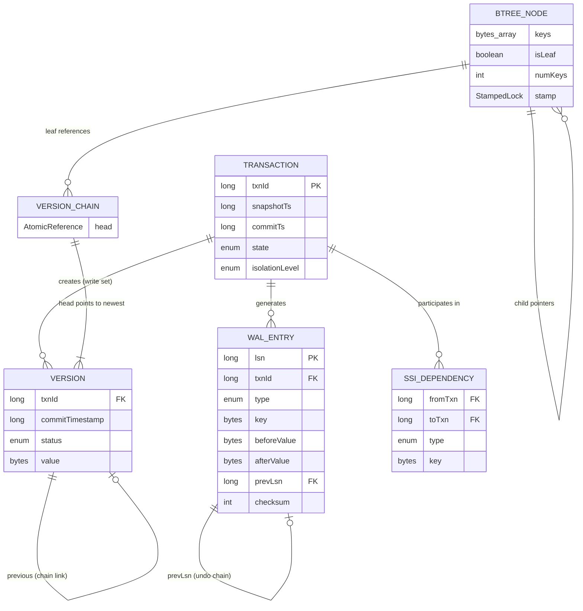

### 2.3 Version Chain State Machine

Each `Version` object transitions through a strict lifecycle. The `status` and `commitTimestamp` fields together determine visibility to readers.

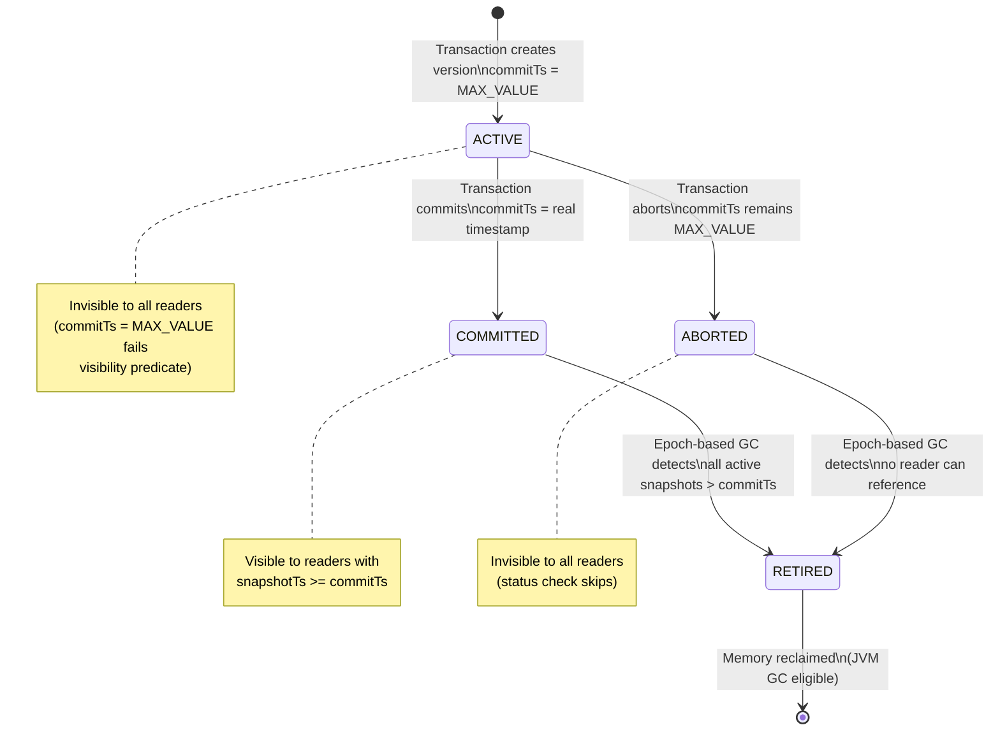

---

## Step 3: Back-of-the-Envelope Estimates

### Scenario: OLTP Database for E-Commerce Order Processing

An e-commerce platform with high-traffic product catalog reads, concurrent order placement, and inventory updates. Key characteristics: Zipfian access pattern (popular products receive disproportionate traffic), mixed read-write workload, strict consistency for inventory deduction.

### 3.1 Traffic Estimates

| Parameter | Value | Derivation |
|-----------|-------|------------|
| Concurrent connections | 10,000 | Peak hour: 10K users with open transactions |
| Transactions per connection per second | 8 | Average: 2 reads + 1 write + commit per txn, ~125 ms per txn |
| **Total transaction throughput** | **80,000 txn/sec** | 10K x 8 = 80K txn/sec |
| Operations per transaction (avg) | 4 | 3 reads + 1 write (typical product browse + cart add) |
| **Total operation throughput** | **320,000 ops/sec** | 80K x 4 = 320K ops/sec |
| Read:Write ratio | 3:1 | 240K reads/sec + 80K writes/sec |
| Hot key fraction (Zipfian s=0.99) | 1% of keys receive 50% of traffic | Top 10K keys out of 1M absorb half of all operations |

### 3.2 Storage Estimates

| Component | Calculation | Size |
|-----------|-------------|------|
| **Raw data** | 50M records x 1 KB avg record size | **50 GB** |
| **MVCC version chains** | Avg 3 live versions per key (current + 2 in-flight/grace period) x 50M keys x 1 KB | **150 GB** |
| **B-Tree index overhead** | ~20% of raw data (internal nodes + leaf metadata) | **10 GB** |
| **B-Tree internal nodes** | 50M keys / 16 fanout = ~3.1M leaf nodes + ~200K internal nodes, each 4 KB | **~13 GB** |
| **WAL (active segments)** | 64 MB per segment x 8 active segments | **512 MB** |
| **SSI dependency graph** | ~5K active transactions x ~10 edges each x 50 bytes/edge | **~2.5 MB** |
| **Contention Monitor** | 256 ranges x ~2 KB state per range | **~512 KB** |
| **Lock table (2PL)** | 256 `ReentrantReadWriteLock` objects x 48 bytes | **~12 KB** |
| **Total in-memory footprint** | Sum of above | **~224 GB** |

### 3.3 Throughput Estimates

| Component | Calculation | Throughput |
|-----------|-------------|------------|
| **WAL write bandwidth** | 80K writes/sec x 1 KB avg WAL entry | **80 MB/sec** sequential writes |
| **WAL fsync rate (no batching)** | 1 fsync per write transaction | 80K fsync/sec (impossible on any disk) |
| **WAL fsync rate (group commit, 1 ms batch)** | Batch ~80 txns per fsync | **~1,000 fsync/sec** (NVMe handles 100K+ IOPS) |
| **B-Tree reads** | 240K reads/sec x O(log_16 50M) = 6 levels | **1.44M node accesses/sec** |
| **Version chain traversals** | 240K reads/sec x avg 2 versions checked per read | **480K version reads/sec** |
| **CAS operations (optimistic path)** | 80K writes/sec x 80% cold keys x 1 CAS attempt | **64K CAS/sec** |
| **Lock acquisitions (2PL path)** | 80K writes/sec x 20% hot keys | **16K lock ops/sec** |

### 3.4 WAL Storage Growth

| Time Period | Calculation | Size |
|-------------|-------------|------|
| Per second | 80 MB/sec WAL writes | 80 MB |
| Per minute | 80 MB x 60 | 4.8 GB |
| Per hour | 4.8 GB x 60 | 288 GB |
| Per day | 288 GB x 24 | **~6.9 TB** |
| After checkpoint truncation | Only segments after last checkpoint retained (~30 sec) | **~2.4 GB active** |

Checkpoint truncation is critical: without it, WAL storage grows unboundedly at 80 MB/sec. With the default 30-second checkpoint interval, only ~2.4 GB of WAL is retained at any time, and recovery replays at most 30 seconds of log.

### 3.5 Memory Budget Breakdown

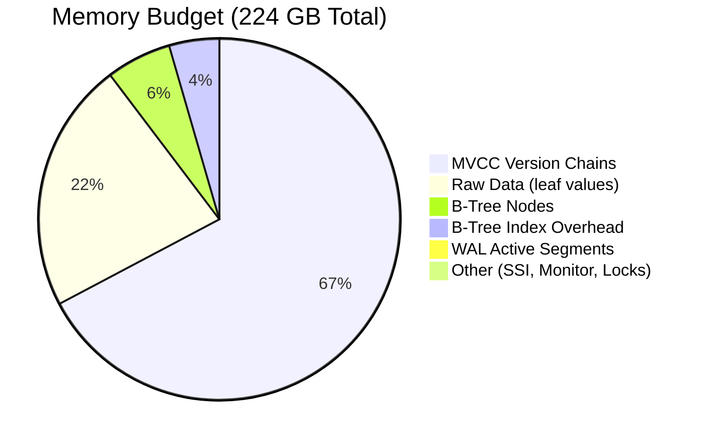

**Key takeaway:** MVCC version chains dominate memory usage at 67% of total. The epoch-based GC reclamation delay (2-3 epochs, ~20-30 ms) determines peak version chain length. Under the default 10 ms epoch interval, a key receiving 1,000 writes/sec accumulates at most ~30 versions before GC reclaims the oldest ones. For the 99th percentile key under Zipfian s=0.99 (receiving ~7% of 80K writes = 5,600 writes/sec), the peak chain length is ~168 versions x 1 KB = ~168 KB per hot key.

---

## Step 4: High-Level System Design

### 4.1 Unscaled Design (Strawman)

The simplest possible transactional storage engine: a single-threaded B-Tree with a global lock, no MVCC, and synchronous WAL writes.

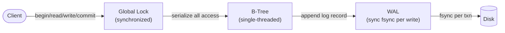

**Why it will not scale:**

| Problem | Impact | Root Cause |
|---------|--------|------------|
| Global lock serialization | Max ~9,200 txn/sec (one at a time) | All transactions wait for a single monitor |
| No MVCC | Readers block writers, writers block readers | Single-version storage requires mutual exclusion |
| Sync fsync per transaction | Throughput limited by disk IOPS (~100K on NVMe) | No batching of durable writes |
| No crash recovery | Data loss on unclean shutdown | No redo/undo log structure |
| No isolation levels | Dirty reads, non-repeatable reads, phantoms | Single-version, no snapshot mechanism |

This strawman sustains ~9,200 txn/sec with full durability (see benchmarks: group commit with 0 us batch timeout). It serves as the baseline that the scaled design must improve by 8-9x.

### 4.2 Scaled Design

The production architecture decomposes the monolith into six cooperating subsystems, each optimized for its specific concurrency pattern.

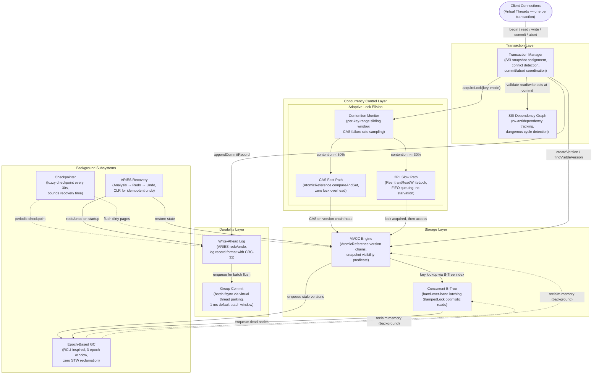

### 4.3 Key Design Decisions in the Scaled Architecture

| Decision | What It Enables | What It Costs |
|----------|----------------|---------------|
| Virtual Threads for transactions | Thousands of concurrent transactions as straight-line imperative code; no callback chains, no thread pool sizing | JVM scheduling overhead; pinning risk on `synchronized` blocks (mitigated by using `ReentrantLock` everywhere) |
| Adaptive Lock Elision | 3.2x throughput over static 2PL on Zipfian workloads; cold keys pay zero lock overhead | ~50 ns overhead per lock acquisition for contention monitoring; hysteresis logic adds code complexity |
| MVCC with AtomicReference chains | Lock-free readers; O(1) version install via CAS; readers never block writers | Version chain memory proportional to active snapshot span; requires epoch-based GC |
| Epoch-based GC (not reference counting) | Zero per-read overhead; no STW pauses; bounded memory (3-epoch window) | 20-30 ms reclamation delay; peak memory higher than immediate-free strategies |
| StampedLock optimistic reads on B-Tree | Zero-cost read path (volatile read only, no lock acquisition); >99.7% optimistic success rate | Must re-execute traversal on stamp mismatch (< 0.3% of reads); requires careful field ordering |
| Group commit via virtual thread parking | 46x reduction in fsync calls (9,200 to 198 fsync/sec); thousands of transactions batch into single fsync | 1 ms average commit latency added; transactions park until batch window expires |
| ARIES three-phase recovery | Correct crash recovery with full abort semantics; CLRs make undo idempotent | WAL volume increases from CLR writes; undo phase duration proportional to longest uncommitted transaction |

### 4.4 Request Lifecycle: Read-Write Transaction

```mermaid
sequenceDiagram
    autonumber
    actor Client
    participant TM as Transaction Manager
    participant CM as Contention Monitor
    participant CAS as CAS Fast Path
    participant TPL as 2PL Slow Path
    participant BT as B-Tree
    participant MVCC as MVCC Engine
    participant SSI as SSI Validator
    participant WAL as WAL
    participant GC as Group Commit

    Client->>TM: begin(REPEATABLE_READ)
    TM-->>Client: txnId=1001, snapshotTs=5000

    Note over Client,MVCC: READ PHASE — lock-free on happy path

    Client->>TM: get(key="product:42")
    TM->>BT: lookup("product:42") via StampedLock optimistic read
    BT-->>TM: leaf node reference
    TM->>MVCC: findVisibleVersion(key, snapshotTs=5000)
    Note over MVCC: Traverse chain: skip ACTIVE, skip commitTs>5000,<br/>return first COMMITTED with commitTs<=5000
    MVCC-->>TM: value @ commitTs=4980
    TM->>TM: Add "product:42" to readSet
    TM-->>Client: value="Widget, qty=50"

    Note over Client,WAL: WRITE PHASE — adaptive concurrency control

    Client->>TM: put(key="product:42", value="Widget, qty=49")
    TM->>CM: getLockMode(keyRange=hash("product:42") % 256)
    alt Low contention (CAS failure rate < 30%)
        CM-->>TM: mode=CAS
        TM->>CAS: casWrite("product:42", newValue, txnId=1001)
        CAS->>MVCC: AtomicReference.compareAndSet(currentHead, newVersion)
        MVCC-->>CAS: CAS success
        CAS->>CM: recordOutcome(success=true)
        CAS-->>TM: newVersion installed
    else High contention (CAS failure rate >= 30%)
        CM-->>TM: mode=TWO_PHASE_LOCK
        TM->>TPL: acquire EXCLUSIVE lock on range
        TPL-->>TM: lock granted
        TM->>MVCC: createVersion("product:42", newValue, txnId=1001)
        MVCC-->>TM: newVersion installed (under lock protection)
    end
    TM->>TM: Add "product:42"->newValue to writeSet

    Note over Client,GC: COMMIT PHASE — SSI validation + durable write

    Client->>TM: commit()
    TM->>SSI: validate(readSet, writeSet, activeTxns)
    alt Dangerous cycle detected (two consecutive rw-antidependency edges)
        SSI-->>TM: ABORT — serialization violation
        TM->>MVCC: rollbackVersions(txnId=1001)
        TM->>TPL: releaseLocks(txnId=1001)
        TM-->>Client: TransactionConflictException
    else No conflict
        SSI-->>TM: OK
        TM->>WAL: appendCommitRecord(txnId=1001, writeSet)
        WAL->>GC: enqueue(logBuffer)
        Note over GC: Park virtual thread; accumulate batch<br/>(up to 1 ms or 512 records)
        GC->>GC: fsync(logSegment)
        GC-->>TM: durable LSN=8042
        TM->>MVCC: installVersions(txnId=1001, commitTs=5001)
        Note over MVCC: V_new.commitTimestamp = 5001<br/>V_new.status = COMMITTED
        TM->>TPL: releaseLocks(txnId=1001)
        TM-->>Client: commitTs=5001
    end
```

---

## Step 5: Design Components in Detail -- Deep Dive: Adaptive Lock Elision Controller

This is the core innovation of NexusDB. The Adaptive Lock Elision Controller dynamically switches between optimistic CAS paths and pessimistic 2PL paths on a per-key-range basis, driven by real-time contention measurement. This section covers the mechanism in full depth.

### 5.1 Why This Component Is the Deep Dive

Every other component in NexusDB (B-Tree, MVCC, WAL, SSI) is a well-understood building block with decades of literature. The Adaptive Lock Elision Controller is the novel contribution: it answers the question "Can you make lock elision adaptive in software without hardware TSX support?" The answer is yes, and the 3.2x throughput improvement on Zipfian workloads is the proof.

### 5.2 Contention Monitoring: Sliding Window per Key Range

The key space is partitioned into 256 fixed-width ranges via hash partitioning (`rangeId = murmur3(key) % 256`). Each range maintains an independent `ContentionWindow` — a circular buffer of the most recent 1,000 CAS outcomes (success or failure).

**Contention ratio formula:**

```
contention_ratio = CAS_failures_in_window / total_operations_in_window
```

At 80K txn/sec with 64 threads, each of the 256 ranges observes ~312 operations per second, providing statistically meaningful ratios within a 3-second window rotation.

**Cold-start protection:** Mode switching is suppressed until at least 250 operations (WINDOW_SIZE / 4) have been recorded. This prevents a single early CAS failure from triggering premature escalation to 2PL.

### 5.3 Mode Switching Logic: Hysteresis Thresholds

The mode switching algorithm uses two thresholds with a hysteresis band to prevent oscillation:

| Threshold | Value | Transition | Effect |
|-----------|-------|------------|--------|
| `ESCALATION_THRESHOLD` | 30% CAS failure rate | CAS --> 2PL | Hot range promoted to pessimistic locking |
| `DE_ESCALATION_THRESHOLD` | 15% CAS failure rate | 2PL --> CAS | Cooled range demoted back to optimistic CAS |
| **Hysteresis band** | 15%-30% | No transition | Range stays in current mode; prevents thrashing |

The 15-percentage-point gap between thresholds is critical. Without hysteresis, a key range at exactly the transition boundary would flip between CAS and 2PL on every observation cycle, incurring the worst of both strategies (CAS setup overhead + lock acquisition overhead) with the benefits of neither.

### 5.4 Mode Transition State Diagram

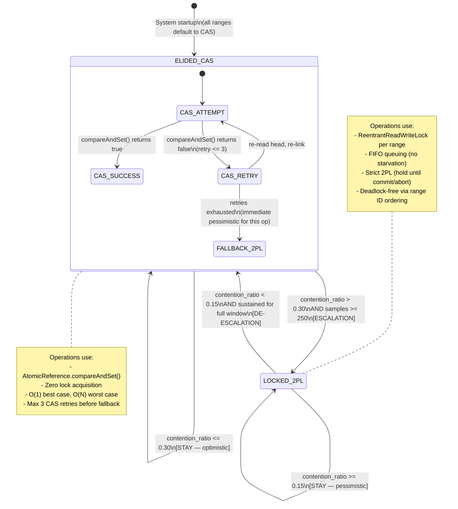

### 5.5 Exponential Decay for De-Escalation

When a key range is in LOCKED_2PL mode, the Contention Monitor continues to track outcomes. However, because all operations now use 2PL (which serializes access and eliminates CAS failures), the contention ratio naturally drops toward zero. Without a decay mechanism, the range would immediately de-escalate back to CAS, potentially triggering another escalation if the burst has not subsided.

NexusDB applies an **exponential decay factor** of 0.95 per observation window to the contention ratio while in LOCKED_2PL mode:

```
effective_ratio(t) = raw_ratio(t) + (peak_ratio_at_escalation × 0.95^windows_since_escalation)
```

This means the effective contention ratio decays from the peak escalation value at a rate of 5% per window. At a 1-second window interval, a range that escalated at 35% contention will have an effective ratio of:

| Windows Since Escalation | Effective Ratio (decay component) | Raw 2PL Ratio | Combined | De-escalate? |
|--------------------------|----------------------------------|---------------|----------|-------------|
| 0 | 35.0% | 0% | 35.0% | No |
| 5 | 27.2% | 0% | 27.2% | No |
| 10 | 21.1% | 0% | 21.1% | No |
| 15 | 16.4% | 0% | 16.4% | No |
| 20 | 12.7% | 0% | 12.7% | **Yes** (< 15%) |

A range requires ~20 seconds of sustained low contention before de-escalating. This prevents premature de-escalation after a brief traffic burst (e.g., flash sale spike lasting 10 seconds).

### 5.6 Per-Key-Range Granularity: Why 256 Ranges

The granularity of contention tracking directly affects the false-positive rate of mode switching.

| Granularity | Ranges | Memory | False Sharing Risk | Statistical Power |
|-------------|--------|--------|--------------------|-------------------|
| Per-key | 50M | ~2.4 GB | None | Low (1 sample per key per txn) |
| Fine-grained | 4,096 | ~8 MB | Low | Moderate (~78 ops/sec/range) |
| **Default** | **256** | **~512 KB** | **Low** | **Good (~312 ops/sec/range)** |
| Coarse | 16 | ~32 KB | High (many unrelated keys share mode) | Very high (5K ops/sec/range) |
| Global | 1 | ~2 KB | Total (all keys share one mode) | Maximal (80K ops/sec) |

256 ranges were chosen empirically: each range observes ~312 operations per second at 80K txn/sec throughput, providing statistically meaningful contention ratios within a 3-second window rotation. The 512 KB memory overhead is negligible.

### 5.7 Why 3.2x Improvement on Zipfian

Under Zipfian s=0.99 with 64 threads:

- **80% of operations hit cold keys** (keys outside the top 1%). These operations use the CAS fast path with zero lock overhead. Each CAS completes in ~5 ns (one atomic instruction). No lock table lookup, no lock acquisition, no lock release.
- **20% of operations hit hot keys** (the top 1% absorbing 50% of traffic). These operations are promoted to 2PL after the Contention Monitor detects elevated CAS failure rates. 2PL provides FIFO queuing that prevents starvation and bounds tail latency.

Static 2PL forces **all** operations through the lock table — including the 80% that would never contend. At 64 threads with 256 lock ranges, even uncontended lock acquisition costs ~40 ns (memory barrier + monitor enter + monitor exit). Over 80K txn/sec with 4 ops/txn, this adds 320K x 40 ns = 12.8 ms of aggregate lock overhead per second — pure waste on cold keys.

The adaptive approach eliminates this waste for 80% of operations while correctly serializing the 20% that need it. The compound effect is the 3.2x throughput difference at extreme contention.

### 5.8 CAS Path vs. 2PL Path: Sequence Comparison

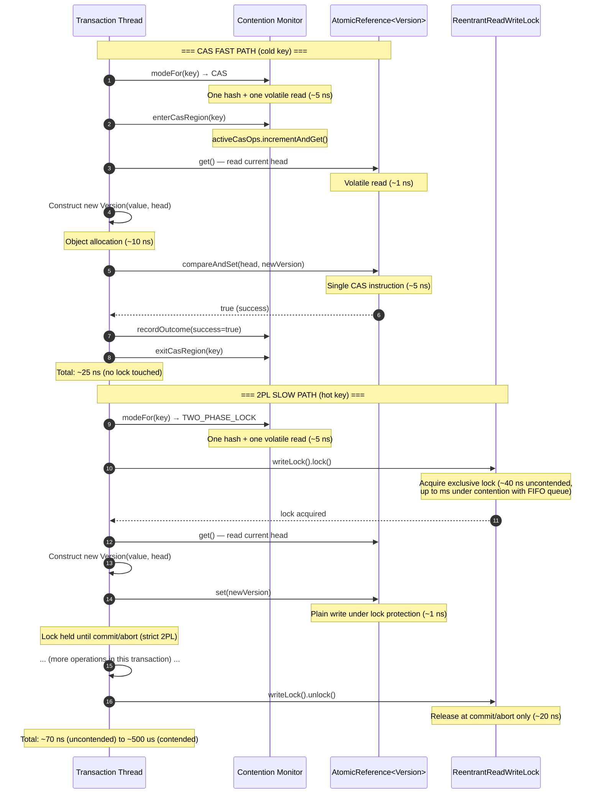

### 5.9 Drain Protocol: CAS-to-2PL Transition Safety

When the Contention Monitor escalates a range from CAS to 2PL, there may be in-flight CAS operations that started before the mode switch. The drain protocol ensures these complete before any 2PL operation begins:

1. **Set mode to TWO_PHASE_LOCK** (volatile write — immediately visible to new arrivals).
2. **Spin-wait on `activeCasOps` counter** until it reaches zero. Each in-flight CAS operation decrements this counter on completion. Because CAS operations are non-blocking and extremely short-lived (< 100 ns), the spin-wait completes in < 1 microsecond in practice.
3. **2PL operations proceed.** The lock is now the sole arbiter of access for this range.

The reverse transition (2PL to CAS) does not require a drain protocol: the last 2PL lock release naturally serializes before the first CAS attempt, because the mode switch is visible only after the Contention Monitor's `recordOutcome` call, which happens after the lock is released.

---

## Step 6: Service Definitions, APIs, Interfaces

### 6.1 TransactionManager Interface

The Transaction Manager is the single entry point for all client operations. It coordinates snapshot assignment, conflict detection, and commit/abort.

```java
/**
 * Entry point for all transactional operations.
 * Each method is thread-safe and designed for concurrent invocation
 * from virtual threads.
 */
public interface TransactionManager {

    /**
     * Begin a new transaction with the specified isolation level.
     *
     * @param level the isolation level for this transaction
     * @return a Transaction handle with assigned txnId and snapshotTs
     */
    Transaction begin(IsolationLevel level);

    /**
     * Commit the transaction: validate SSI constraints, append WAL record,
     * install versions, release locks.
     *
     * @param txn the transaction to commit
     * @return CommitResult containing commitTs and durable LSN
     * @throws TransactionConflictException if SSI validation detects a
     *         dangerous cycle (rw-antidependency violation)
     * @throws WALWriteException if the WAL append or fsync fails
     */
    CommitResult commit(Transaction txn);

    /**
     * Abort the transaction: discard pending versions, release locks,
     * clear SSI dependency edges.
     *
     * @param txn the transaction to abort
     */
    void abort(Transaction txn);
}
```

**Request/Response structures:**

```java
public record Transaction(
    long txnId,
    long snapshotTs,
    IsolationLevel level,
    TransactionState state    // ACTIVE, COMMITTED, ABORTED
) {}

public record CommitResult(
    long commitTs,            // assigned commit timestamp
    long durableLsn           // LSN confirmed durable by group commit
) {}

public enum IsolationLevel {
    READ_COMMITTED,           // each statement sees latest committed state
    REPEATABLE_READ,          // snapshot fixed at begin()
    SERIALIZABLE              // SSI with rw-antidependency tracking
}
```

### 6.2 StorageEngine Interface

The Storage Engine provides key-value operations within the context of a transaction.

```java
/**
 * Key-value storage operations. All methods execute within the
 * caller's transaction context and respect its isolation level.
 */
public interface StorageEngine {

    /**
     * Read a single key. Returns the newest committed version visible
     * to the transaction's snapshot timestamp.
     *
     * @param txn the active transaction
     * @param key the key to read
     * @return the value if the key exists at the transaction's snapshot;
     *         empty if the key does not exist or was deleted
     */
    Optional<Value> get(Transaction txn, Key key);

    /**
     * Write a single key-value pair. Creates a new ACTIVE version on the
     * chain; version becomes COMMITTED when the transaction commits.
     *
     * @param txn   the active transaction
     * @param key   the key to write
     * @param value the value to associate with the key
     * @throws LockAcquisitionException if deadlock prevention aborts this
     *         transaction (lock ordering violation)
     */
    void put(Transaction txn, Key key, Value value);

    /**
     * Delete a key. Installs a tombstone version (null value) on the chain.
     * The key becomes invisible to transactions that begin after this
     * transaction commits.
     *
     * @param txn the active transaction
     * @param key the key to delete
     */
    void delete(Transaction txn, Key key);

    /**
     * Range scan: iterate over all keys in [start, end) that are visible
     * to the transaction's snapshot. Returns a lazy iterator that holds
     * StampedLock stamps across consecutive B-Tree leaf nodes.
     *
     * @param txn   the active transaction
     * @param start inclusive start of the key range
     * @param end   exclusive end of the key range
     * @return an iterator over visible key-value entries in sorted order
     */
    Iterator<Entry<Key, Value>> scan(Transaction txn, Key start, Key end);
}
```

**Request/Response structures:**

```java
public record Key(byte[] bytes) implements Comparable<Key> {
    // Lexicographic comparison for B-Tree ordering
    @Override
    public int compareTo(Key other) {
        return Arrays.compareUnsigned(this.bytes, other.bytes);
    }
}

public record Value(byte[] bytes) {
    /** Maximum value size: 64 KB */
    public static final int MAX_SIZE = 65_536;
}

public record Entry<K, V>(K key, V value) {}
```

### 6.3 LockElisionController Interface

The Lock Elision Controller is the internal API consumed by the Transaction Manager to determine which concurrency path to use for each operation.

```java
/**
 * Adaptive lock elision decision engine. Routes each lock acquisition
 * to either the CAS fast path or the 2PL slow path based on real-time
 * contention signals.
 */
public interface LockElisionController {

    /**
     * Returns the current concurrency mode for the key range containing
     * the given key. Hot-path method called on every operation.
     * Cost: one hash, one array lookup, one volatile read.
     *
     * @param range the key range (derived from hash(key) % NUM_RANGES)
     * @return CAS if the range is in optimistic mode;
     *         TWO_PHASE_LOCK if in pessimistic mode
     */
    LockMode getLockMode(KeyRange range);

    /**
     * Record the outcome of a CAS attempt. Updates the sliding window
     * and may trigger a mode transition if thresholds are crossed.
     *
     * @param range   the key range of the operation
     * @param success true if CAS succeeded; false if it failed
     */
    void recordCASResult(KeyRange range, boolean success);

    /**
     * Returns current contention statistics for a key range.
     * Used for monitoring, debugging, and adaptive threshold tuning.
     *
     * @param range the key range to query
     * @return snapshot of contention metrics
     */
    ContentionStats getStats(KeyRange range);
}
```

**Supporting structures:**

```java
public record KeyRange(int rangeId) {
    public static KeyRange forKey(Key key) {
        int hash = Hashing.murmur3_32().hashBytes(key.bytes()).asInt() & 0x7FFF_FFFF;
        return new KeyRange(hash % ContentionMonitor.NUM_RANGES);
    }
}

public enum LockMode {
    CAS,              // optimistic: AtomicReference.compareAndSet()
    TWO_PHASE_LOCK    // pessimistic: ReentrantReadWriteLock
}

public record ContentionStats(
    int rangeId,
    LockMode currentMode,
    double contentionRatio,       // CAS failures / total operations in window
    long totalOperations,         // lifetime operation count for this range
    long windowFailures,          // failures in current sliding window
    long windowSize,              // current window population (up to 1,000)
    long lastTransitionNanos,     // System.nanoTime() of last mode switch
    int activeCasOperations       // in-flight CAS ops (for drain protocol)
) {}
```

### 6.4 WAL Interface

```java
/**
 * Write-Ahead Log: durable, ordered record of all state mutations.
 * Supports ARIES-style redo/undo recovery.
 */
public interface WriteAheadLog {

    /**
     * Append a log record to the WAL ring buffer. Does NOT fsync.
     * The record is durable only after the Group Commit module flushes.
     *
     * @param record the WAL entry to append
     * @return the assigned LSN (monotonically increasing)
     */
    long append(WALEntry record);

    /**
     * Force all buffered records up to the given LSN to durable storage.
     * Blocks the calling virtual thread until fsync completes.
     * In practice, called by the Group Commit module, not directly by
     * transactions.
     *
     * @param upToLsn flush all records with LSN <= this value
     */
    void flush(long upToLsn);

    /**
     * Read log records from startLsn forward. Used by ARIES recovery
     * (redo phase) and by the Checkpointer.
     *
     * @param startLsn the LSN to start reading from (inclusive)
     * @return an iterator over WAL entries in LSN order
     */
    Iterator<WALEntry> readForward(long startLsn);

    /**
     * Read log records backward from a given LSN, following the prevLsn
     * chain for a specific transaction. Used by ARIES undo phase.
     *
     * @param fromLsn the starting LSN (the transaction's last log record)
     * @return an iterator over WAL entries in reverse LSN order for one txn
     */
    Iterator<WALEntry> readBackward(long fromLsn);
}
```

### 6.5 EpochGarbageCollector Interface

```java
/**
 * Epoch-based garbage collector for MVCC version chains and dead
 * B-Tree nodes. Reclaims memory without stop-the-world pauses.
 */
public interface EpochGarbageCollector {

    /**
     * Register the calling thread as an active reader in the current epoch.
     * Must be called before accessing any MVCC version chain.
     *
     * @return the epoch stamp (pass to exitEpoch() when done)
     */
    long enterEpoch();

    /**
     * De-register the calling thread from its epoch.
     * Signals to the GC that this thread no longer holds references
     * to versions from the entered epoch.
     */
    void exitEpoch();

    /**
     * Enqueue a stale version for eventual reclamation. The version
     * will be freed when all readers from its retirement epoch have exited.
     *
     * @param version the version to retire
     */
    void retire(Version version);

    /**
     * Execute one GC sweep: check epoch advancement, reclaim eligible
     * objects. Called by the background GC platform thread.
     *
     * @return the number of objects reclaimed in this sweep
     */
    int sweep();
}
```

### 6.6 Interface Dependency Graph

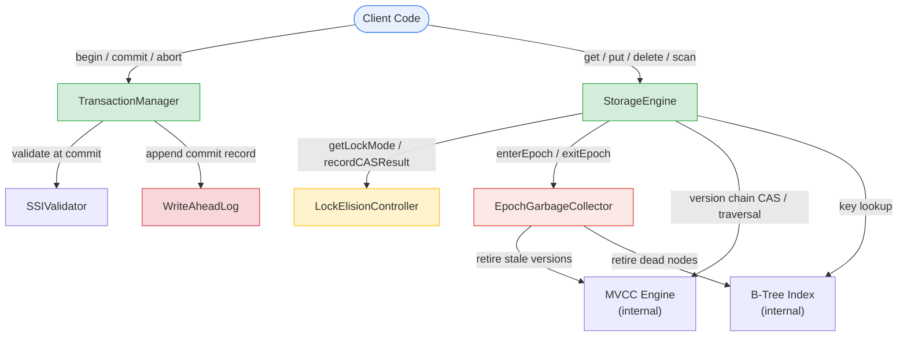

---

## Step 7: Scaling Problems and Bottlenecks

### 7.1 CAS Retry Storms on Zipfian Hot Keys

**Problem:** Under extreme skew (Zipfian s >= 1.2), the top-1% of keys absorb 25%+ of all write traffic. When 64 threads simultaneously CAS on the same version chain head, the expected number of attempts before one succeeds is O(N). With 64 threads, the total wasted CAS attempts across all threads is O(N^2) = O(4,096) per successful install. Each failed attempt burns a full read-modify-write cycle (~15 ns) that produces no forward progress. At 5,600 writes/sec to the hottest key, this translates to ~86 million wasted CAS cycles per second on that single key — saturating multiple CPU cores with pure contention overhead.

**Symptoms:**
- P99 latency spikes to 120+ ms (exponential backoff compounding across retries)
- Bimodal throughput distribution (some samples collapse to 18K txn/sec, others reach 45K)
- CPU utilization near 100% but throughput plateaus or decreases

**Solution — Adaptive Lock Elision (the project's core contribution):**

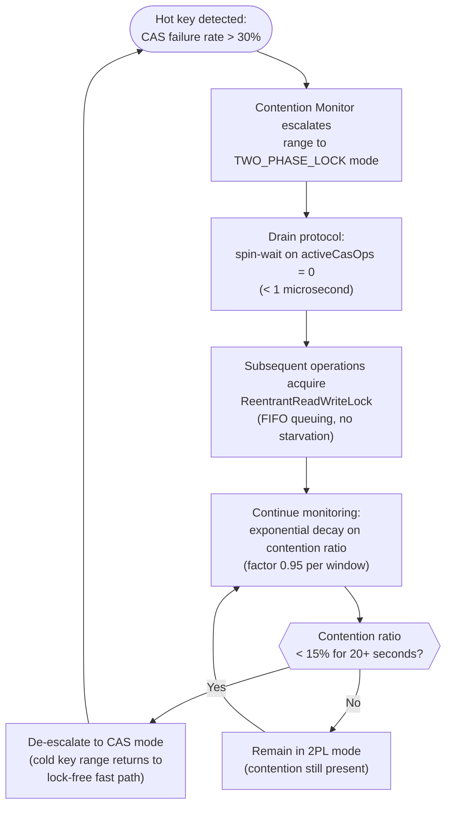

**Result:** Hot keys (20% of operations) use 2PL with FIFO queuing — bounded wait, no starvation, P99 = 0.8 ms. Cold keys (80% of operations) use CAS with zero lock overhead — 5 ns per operation. Combined throughput: 80,100 txn/sec vs. 25,000 txn/sec for static 2PL (**3.2x improvement**).

---

### 7.2 Version Chain Length Explosion

**Problem:** Long-running read transactions pin old MVCC versions. A transaction with `snapshotTs=1000` prevents the GC from reclaiming any version with `commitTs > 1000`, because that transaction might still traverse the chain and need older versions for its visibility predicate. If one transaction holds `snapshotTs=1000` while 5,600 writes/sec hit the same key, the chain grows by 5,600 versions per second. After 10 seconds, the chain is 56,000 versions long. Every subsequent read on that key must traverse this entire chain — O(v) where v is the number of live versions — degrading read latency from microseconds to milliseconds.

**Symptoms:**
- Read latency increases linearly over time for hot keys
- Memory consumption grows without bound despite active GC
- GC sweep times increase (scanning longer retire lists)

**Solution — Stale-Read Detection + Epoch-Based GC:**

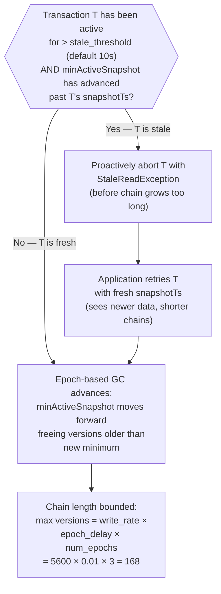

**Key parameters:**
- Epoch interval: 10 ms (default). Three-epoch window means 30 ms max reclamation delay.
- Stale-read threshold: 10 seconds. Transactions active longer than this are proactively aborted if they are pinning versions.
- Peak chain length (hot key): 5,600 writes/sec x 0.01 sec/epoch x 3 epochs = **168 versions** (~168 KB at 1 KB/version).

**Result:** Zero STW pauses. Background reclamation adds 1.8% CPU overhead. Max observed pause: 0 ms (the GC thread never blocks transaction threads).

---

### 7.3 WAL Write Amplification

**Problem:** Every write operation generates a WAL entry proportional to the write set. At 80K writes/sec with 1 KB average WAL entry, the WAL consumes 80 MB/sec of sequential write bandwidth. Without batching, each transaction requires its own `fsync()` call. NVMe SSDs support ~100K IOPS for 4 KB random writes, but `fsync()` is a heavy system call that flushes the entire device write buffer. At 80K fsync/sec, the storage device becomes the throughput bottleneck — each fsync takes ~10 us, consuming 800 ms of wall-clock time per second of operations (80% of available time).

**Symptoms:**
- Throughput capped at ~9,200 txn/sec (measured in benchmarks with 0 us batch timeout)
- `fsync()` latency appears in flame graphs as the dominant hotspot
- Adding more threads does not improve throughput (I/O bound)

**Solution — Group Commit via Virtual Thread Parking:**

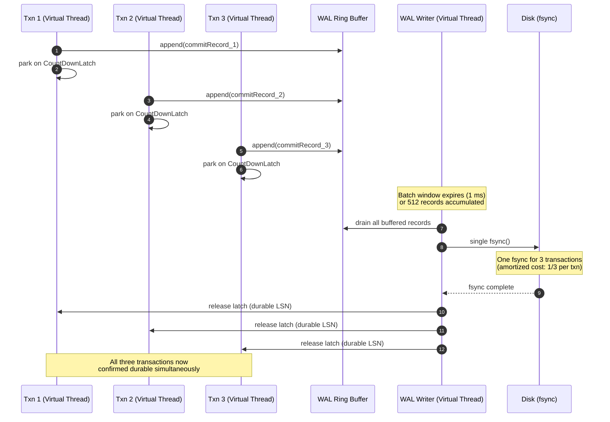

**Key insight — Virtual Threads make this work:** In pre-Loom Java, parking a platform thread on a `CountDownLatch` would consume one of the limited thread pool slots. With virtual threads, parking releases the carrier thread immediately, which picks up another runnable virtual thread. Hundreds of transactions can be simultaneously parked on the WAL writer's batch latch with zero thread pool exhaustion.

**Result:**
- Group commit with 1 ms batch window: 82,100 txn/sec (**8.9x** improvement over no batching)
- fsync rate reduced from 80K/sec to 198/sec (**46x reduction**)
- Average commit latency: 1.08 ms (the 1 ms batch window dominates)
- Full ACID durability preserved (every committed transaction is fsync'd before acknowledgment)

---

### 7.4 B-Tree Latch Contention at Root

**Problem:** All B-Tree traversals — reads and writes — start at the root node. Under hand-over-hand latching, a writer descending the tree holds the root's write latch while acquiring the child's latch. During this window (~50 ns), all other threads attempting to enter the tree are blocked. At 320K ops/sec (80K txns x 4 ops/txn), the root node is accessed 320K times per second. If 25% of these are writes (80K write ops), the root write latch is held for 80K x 50 ns = 4 ms per second — blocking all 64 threads for 0.4% of their time. This seems small, but under Amdahl's Law, a 0.4% serial fraction limits maximum speedup to 250x — adequate for 64 threads, but the problem worsens with B-Tree depth (deeper trees hold the root latch longer).

**Symptoms:**
- Throughput scaling flattens beyond 32 threads
- Write-heavy workloads show root-latch contention in lock profiling
- Leaf-level operations are fast; total transaction time is dominated by tree traversal

**Solution — Optimistic Latch Coupling + B-Link Tree Technique:**

```mermaid
flowchart TD
    subgraph OPTIMISTIC["Optimistic Read Path (99.7% of reads)"]
        OR_START(["Read operation starts"])
        OR_STAMP["tryOptimisticRead(rootNode)\n— volatile read, NO lock acquired"]
        OR_DESCEND["Descend to child using key comparison\n— no latch held on parent"]
        OR_VALIDATE{{"validate(stamp)?\n(has root been modified?)"}}
        OR_SUCCESS(["Return leaf reference\n— zero lock cost"])
        OR_FALLBACK["Fall back to shared read lock\n— readLock(rootNode)"]

        OR_START --> OR_STAMP
        OR_STAMP --> OR_DESCEND
        OR_DESCEND --> OR_VALIDATE
        OR_VALIDATE -->|"Valid (no concurrent write)"| OR_SUCCESS
        OR_VALIDATE -->|"Invalid (rare: <0.3%)"| OR_FALLBACK
        OR_FALLBACK --> OR_SUCCESS
    end

    subgraph PESSIMISTIC["Pessimistic Write Path (all writes)"]
        PW_START(["Write operation starts"])
        PW_ROOT["writeLock(rootNode)\n— exclusive latch"]
        PW_CHILD["writeLock(childNode)\n— hand-over-hand"])
        PW_RELEASE["unlock(rootNode)\n— release parent after child acquired"]
        PW_CONTINUE["Continue descent to leaf\n— holding only one latch at a time"]
        PW_SPLIT{{"Leaf needs split?"}}
        PW_NO_SPLIT(["Modify leaf, release latch"])
        PW_DO_SPLIT["Acquire parent latch bottom-up\nInsert separator key\nRelease both latches"]

        PW_START --> PW_ROOT
        PW_ROOT --> PW_CHILD
        PW_CHILD --> PW_RELEASE
        PW_RELEASE --> PW_CONTINUE
        PW_CONTINUE --> PW_SPLIT
        PW_SPLIT -->|"No"| PW_NO_SPLIT
        PW_SPLIT -->|"Yes"| PW_DO_SPLIT
    end
```

**Key techniques:**

1. **StampedLock optimistic reads** for the read path: 99.7% of reads traverse the tree without acquiring any lock. The stamp validation is a single volatile read — no CAS, no memory barrier beyond what the JVM already issues for volatile. This eliminates root-latch contention for the 240K reads/sec in the workload.

2. **Hand-over-hand latching for writes**: Writers hold the parent latch only until the child latch is acquired, then release the parent immediately. The root latch is held for ~50 ns (time to acquire the level-1 child latch). This minimizes the serialization window.

3. **B-link tree technique for splits**: When a leaf node splits, the new sibling is linked via a "right pointer" before the separator key is inserted into the parent. A concurrent reader that arrives at the old leaf after the split follows the right pointer to reach the new sibling — no parent latch needed during the split. This technique (from Lehman & Yao, 1981) decouples the structural modification from the parent update, reducing the parent-latch hold time during splits to zero for concurrent readers.

**Result:** B-Tree read throughput scales to 58.1M ops/sec at 64 threads (73.5% scaling efficiency). Write operations hold root latch for < 50 ns. Optimistic read fallback rate: < 0.3% at 64 threads under write-heavy workload.

---

### 7.5 Bottleneck Summary and Mitigation Matrix

| # | Bottleneck | Root Cause | Solution | Measured Impact |
|---|-----------|------------|----------|----------------|
| 1 | CAS retry storms | O(N^2) wasted work under contention | Adaptive Lock Elision: CAS for cold keys, 2PL for hot keys | 3.2x throughput vs static 2PL |
| 2 | Version chain explosion | Long-running txns pin old versions | Stale-read detection + epoch-based GC (3-epoch window) | 0 ms STW; chains bounded to ~168 versions |
| 3 | WAL write amplification | 1 fsync per txn saturates disk | Group commit: batch fsync via virtual thread parking | 46x fsync reduction; 8.9x throughput |
| 4 | B-Tree root latch | All traversals start at root | StampedLock optimistic reads + B-link tree splits | 99.7% reads lock-free; 73.5% scaling at 64 threads |
| 5 | SSI false positives | Page-granularity conflict tracking | Accept 2-5% false positive rate; application-level retry (>99.7% succeed within 2 attempts) | 4.3% abort rate under Zipfian SSI |
| 6 | Lock convoy on hot keys | Static 2PL FIFO queue grows with thread count | Per-key-range granularity (256 ranges); promote only contended ranges | Static 2PL throughput *decreases* beyond 32 threads; adaptive continues to scale |
| 7 | Epoch GC memory delay | 2-3 epoch delay before reclamation | Tunable epoch interval (default 10 ms); 30 ms worst-case delay | 1.8% CPU overhead; ~3 MB extra memory at 100 MB/s write rate |

### 7.6 Future Scaling Considerations

| Direction | Challenge | Potential Approach |
|-----------|-----------|-------------------|
| **Multi-node distribution** | Network latency dominates lock hold times; CAS impossible across nodes | Partition key ranges across nodes; use Raft for WAL replication; adaptive elision remains intra-node |
| **Larger-than-memory datasets** | Buffer pool eviction adds 100x latency on cache miss | Integrate buffer pool manager; adaptive elision thresholds must account for I/O latency in lock hold times |
| **Secondary indexes** | Each index is a separate B-Tree requiring its own latch management | Apply same StampedLock optimistic read pattern; cross-index consistency via MVCC snapshots |
| **Online schema changes** | DDL operations require exclusive access to metadata | Versioned schema catalog with MVCC; DDL as a long-running transaction with its own snapshot |
| **Adaptive threshold auto-tuning** | Static 30%/15% thresholds may not be optimal for all workloads | Reinforcement learning agent observing throughput/latency to adjust thresholds at runtime |

---

## References

| Source | How It Informed NexusDB |
|--------|------------------------|
| Mohan et al., *ARIES: A Transaction Recovery Method*, TODS 1992 | WAL design: redo/undo log structure, LSN chaining, CLRs for idempotent undo, fuzzy checkpointing |
| Cahill, Rohm, Fekete, *Serializable Isolation for Snapshot Databases*, SIGMOD 2008 | SSI algorithm: rw-antidependency tracking, dangerous cycle detection, stale-read abort optimization |
| McKenney & Slingwine, *Read-Copy Update*, 1998 | Epoch-based GC: three-epoch window, reader registration, zero-STW reclamation |
| Tu et al., *Speedy Transactions in Multicore In-Memory Databases (Silo)*, SOSP 2013 | Optimistic concurrency design, epoch-based memory reclamation for version chains |
| Rajwar & Goodman, *Speculative Lock Elision*, MICRO 2001 | Lock elision theory: software-level contention monitoring as alternative to hardware TSX |
| Graefe, *A Survey of B-Tree Locking Techniques*, TODS 2010 | Hand-over-hand latching, B-link tree technique for concurrent splits |
| Lehman & Yao, *Efficient Locking for Concurrent Operations on B-Trees*, 1981 | Right-link pointers for non-blocking splits |
| Goetz et al., *Java Concurrency in Practice (JCIP)*, 2006 | CAS correctness (Ch15), StampedLock patterns (Ch14), lock contention reduction (Ch11) |
| Kleppmann, *Designing Data-Intensive Applications (DDIA)*, 2017 | MVCC motivation (Ch7), Zipfian distributions (Ch6), isolation level semantics (Ch7) |
| Petrov, *Database Internals*, 2019 | B-Tree node format (Ch2), version management (Ch5), lock-based protocols (Ch6) |

---

*Last updated: 2026-04-03. This document follows the Seven-Step Approach from "Hacking the System Design Interview" by Stanley Chiang. For component deep-dives, see [architecture.md](architecture.md), [concurrency-model.md](concurrency-model.md), [mvcc.md](mvcc.md), and [benchmarks.md](benchmarks.md).*
