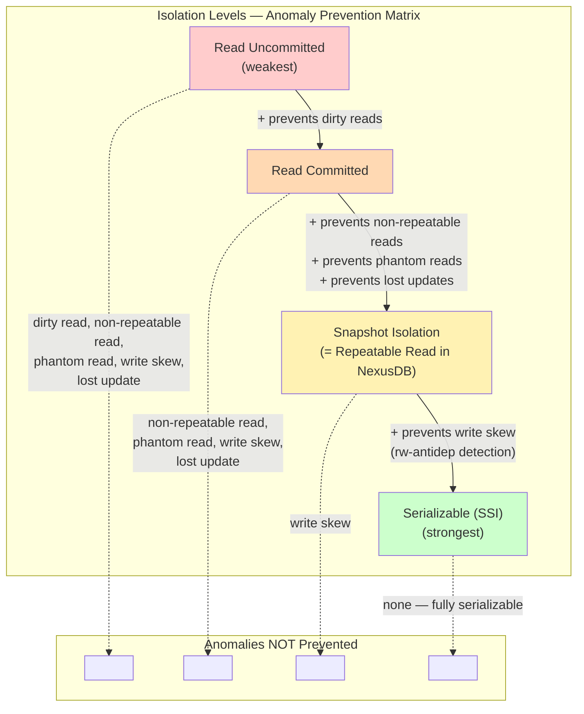
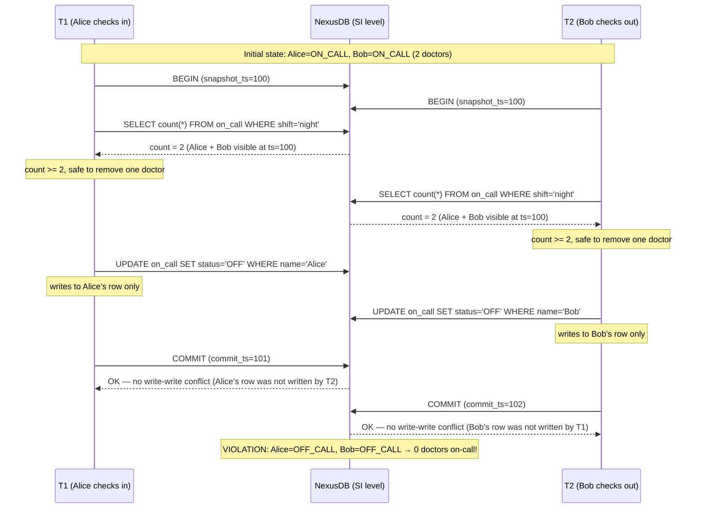
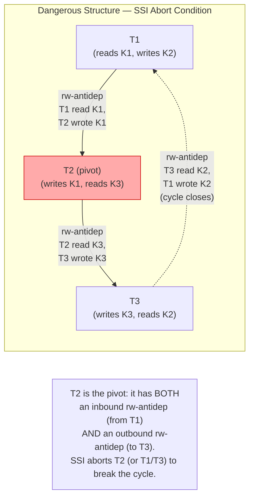
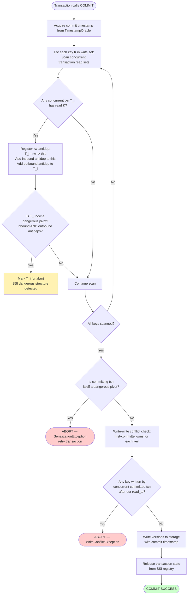
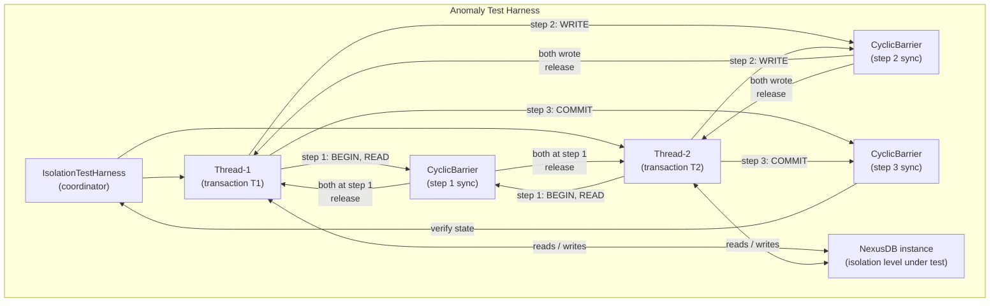

# Transaction Isolation in NexusDB

A Staff Engineer-level deep-dive into NexusDB's Serializable Snapshot Isolation (SSI) implementation, anomaly taxonomy, and test methodology.

---

## Table of Contents

1. [Isolation Levels Overview](#1-isolation-levels-overview)
2. [Snapshot Isolation Foundation](#2-snapshot-isolation-foundation)
3. [The Write Skew Problem](#3-the-write-skew-problem)
4. [Serializable Snapshot Isolation (SSI)](#4-serializable-snapshot-isolation-ssi)
5. [Stale-Read Detection and Write-Dependency Tracking](#5-stale-read-detection-and-write-dependency-tracking)
6. [Anomaly Prevention Summary](#6-anomaly-prevention-summary)
7. [Anomaly Test Suite](#7-anomaly-test-suite)
8. [Design Decisions (ADR)](#8-design-decisions-adr)
9. [See Also](#9-see-also)

---

## 1. Isolation Levels Overview

SQL standard isolation levels are defined by which anomalies they permit. NexusDB maps each level to the set of anomalies it prevents:



**Key observation:** Snapshot Isolation already eliminates four of the five classical anomalies. Write skew is the only anomaly that survives SI — and it requires SSI's rw-antidependency detection to close.

**NexusDB defaults:** The default isolation level is `SNAPSHOT`. `SERIALIZABLE` is opt-in per transaction via `BEGIN ISOLATION LEVEL SERIALIZABLE`. `READ COMMITTED` is supported for analytics workloads where stale reads are acceptable. `READ UNCOMMITTED` is not implemented — NexusDB's MVCC architecture makes dirty reads impossible at the storage layer.

---

## 2. Snapshot Isolation Foundation

### 2.1 How Snapshots Work

Every transaction in NexusDB receives a **snapshot timestamp** at `BEGIN`. This timestamp is a monotonically increasing logical clock value issued by the central `TimestampOracle`.

```
T_read  = oracle.beginTimestamp()   // assigned at BEGIN
T_write = oracle.commitTimestamp()  // assigned at COMMIT
```

A transaction with `T_read = 100` sees exactly the set of committed versions where `commit_ts <= 100`. It never sees:
- Versions written by transactions that committed after `T_read = 100`
- Versions written by transactions that have not yet committed (uncommitted data)

This is the **consistent snapshot** guarantee. The snapshot is fixed for the lifetime of the transaction — re-reading the same key always returns the same value from the snapshot, regardless of concurrent commits.

### 2.2 MVCC Storage Layer

NexusDB stores multiple versions of each key in the LSM tree. Each version is tagged with `(key, commit_ts)`. A read of key `K` at snapshot `T_read` performs:

```
max { version(K, ts) | ts <= T_read and ts is a committed timestamp }
```

Version visibility is enforced in the read path — no explicit locking required for reads. This is the key advantage of MVCC: **readers never block writers, writers never block readers**.

See [mvcc.md](./mvcc.md) for the full version chain implementation.

### 2.3 First-Committer-Wins Rule

When two transactions `T1` and `T2` both write key `K` with overlapping lifetimes, SI uses **first-committer-wins**:

1. `T1` and `T2` both begin with snapshot timestamps `T1_read` and `T2_read`
2. Both write key `K` to their private write buffers
3. `T1` commits first: `K` gets version at `T1_commit`
4. `T2` attempts to commit: detects that `K` was written by a concurrent transaction (`T1_commit > T2_read`)
5. `T2` aborts with `WRITE_CONFLICT`

This rule is enforced during commit-time write-set validation:

```java
// Pseudocode: commit-time write conflict check (SI level)
for (Key key : txn.writeSet()) {
    long latestCommitTs = versionStore.latestCommitTs(key);
    if (latestCommitTs > txn.readTimestamp()) {
        throw new WriteConflictException(key, txn.id());
    }
}
```

### 2.4 What SI Prevents and What It Does Not

| Anomaly | Prevented by SI? | Mechanism |
|---|---|---|
| Dirty read | Yes | Only committed versions are visible (MVCC) |
| Non-repeatable read | Yes | Fixed snapshot timestamp — re-reads see same version |
| Phantom read | Yes | Snapshot captures committed set at `T_read`; new inserts invisible |
| Lost update | Yes | First-committer-wins on write-write conflict |
| Write skew | **No** | Transactions write *different* keys — no write-write conflict detected |

**Reference:** Kleppmann, *Designing Data-Intensive Applications* (DDIA), Chapter 7, "Snapshot Isolation and Repeatable Read."

---

## 3. The Write Skew Problem

### 3.1 The Doctor-on-Call Example

Write skew is the subtlest isolation anomaly. It occurs when two transactions read overlapping data and then make *disjoint* writes that together violate a constraint that either transaction alone would have preserved.

The canonical example from DDIA Ch7 — a hospital requiring at least one doctor on-call at all times:



### 3.2 Why SI Misses Write Skew

First-committer-wins only triggers when two transactions write the **same key**. In the doctor example:

- `T1` writes only `Alice`'s row
- `T2` writes only `Bob`'s row
- There is no write-write conflict on any key

SI's commit validation passes for both transactions. The invariant (`count >= 1`) is violated not by any individual write, but by the *combination* of writes from two concurrent transactions.

### 3.3 Generalization of Write Skew

Write skew follows a general pattern:

1. Transaction `T1` reads a set `R1` that includes data about the shared resource
2. Transaction `T2` reads a set `R2` that overlaps with `R1`
3. `T1` writes to set `W1` that does not overlap with `W2` (disjoint writes)
4. `T2` writes to set `W2` that does not overlap with `W1`
5. The constraint that `T1` and `T2` each checked is violated by the combined effect of both writes

The invariant being checked lives in the *read set*, but the mutation lives in the *write set*. Because `W1 ∩ W2 = ∅`, first-committer-wins never fires.

Other real-world write skew patterns:
- **Double-booking:** Two reservation systems each read "room is available" and both book it
- **Username uniqueness:** Two signups both check "username not taken" and both create the account
- **Balance floor:** Two withdrawals each read current balance and both execute, taking balance negative

**Reference:** DDIA Ch7, "Write Skew and Phantoms."

---

## 4. Serializable Snapshot Isolation (SSI)

### 4.1 Theoretical Foundation

SSI was introduced by Cahill, Röhm, and Fekete in **"Serializable Isolation for Snapshot Databases"** (SIGMOD 2008). The key insight: any non-serializable execution under SI must contain a **dangerous structure** in the transaction dependency graph.

A dangerous structure is a cycle that involves **exactly two consecutive rw-antidependency edges** through a common "pivot" transaction.

### 4.2 Transaction Dependency Edges

Three types of edges exist in the transaction dependency graph:

| Edge Type | Notation | Meaning |
|---|---|---|
| wr-dependency | `T1 --wr--> T2` | T1 committed a write that T2 read |
| ww-dependency | `T1 --ww--> T2` | T1 committed a write that T2 overwrote |
| rw-antidependency | `T1 --rw--> T2` | T1 read a version that T2 later overwrote |

SSI focuses on **rw-antidependencies** because they are the only edge type that can form a cycle without a write-write conflict (which SI already detects).

### 4.3 The Dangerous Structure



**Dangerous structure definition:** Transaction `T_pivot` is dangerous if it has:
- At least one **inbound** rw-antidependency: some `T_in --rw--> T_pivot` (T_in read data that T_pivot wrote)
- At least one **outbound** rw-antidependency: `T_pivot --rw--> T_out` (T_pivot read data that T_out wrote)

When this structure is detected, SSI conservatively aborts one of the involved transactions.

**Note on false positives:** SSI may abort transactions that would have produced a serializable result (false positives). This is acceptable — aborted transactions can be retried. The guarantee is: no non-serializable execution ever commits. DDIA Ch7 notes that false abort rates are low in practice for typical OLTP workloads.

### 4.4 Implementation: Read-Set and Write-Set Tracking

NexusDB tracks per-transaction read sets and write sets in `SsiTransactionState`:

```java
/**
 * SSI transaction state. Tracks reads and writes for antidependency detection.
 * Held in memory for the duration of the transaction; released on commit or abort.
 *
 * Reference: Cahill et al., SIGMOD 2008; DDIA Ch7; DB Internals Ch6.
 */
public class SsiTransactionState {

    private final long txnId;
    private final long readTimestamp;

    // Keys read by this transaction (point reads)
    private final Set<ByteKey> readSet = ConcurrentHashMap.newKeySet();

    // Predicate locks for range reads (key prefix → read)
    private final List<KeyRange> readRanges = new CopyOnWriteArrayList<>();

    // Keys written by this transaction
    private final Set<ByteKey> writeSet = ConcurrentHashMap.newKeySet();

    // Inbound rw-antidependencies: T_other --rw--> this
    // Meaning: T_other read a key that this transaction has written
    private final Set<Long> inboundRwAntideps = ConcurrentHashMap.newKeySet();

    // Outbound rw-antidependencies: this --rw--> T_other
    // Meaning: this transaction read a key that T_other has written
    private final Set<Long> outboundRwAntideps = ConcurrentHashMap.newKeySet();

    public void recordRead(ByteKey key) {
        readSet.add(key);
    }

    public void recordRangeRead(ByteKey start, ByteKey end) {
        readRanges.add(new KeyRange(start, end));
    }

    public void recordWrite(ByteKey key) {
        writeSet.add(key);
    }

    public void addInboundAntidep(long fromTxnId) {
        inboundRwAntideps.add(fromTxnId);
    }

    public void addOutboundAntidep(long toTxnId) {
        outboundRwAntideps.add(toTxnId);
    }

    /**
     * Dangerous structure: this transaction is a pivot if it has both
     * inbound AND outbound rw-antidependencies.
     */
    public boolean isDangerousPivot() {
        return !inboundRwAntideps.isEmpty() && !outboundRwAntideps.isEmpty();
    }

    public Set<ByteKey> getReadSet()  { return Collections.unmodifiableSet(readSet);  }
    public Set<ByteKey> getWriteSet() { return Collections.unmodifiableSet(writeSet); }
    public long getTxnId()            { return txnId; }
    public long getReadTimestamp()    { return readTimestamp; }
}
```

### 4.5 Antidependency Detection on Commit

When transaction `T2` commits a write to key `K`, NexusDB's `SsiValidator` scans all concurrent transaction states to find transactions that read `K`:

```java
/**
 * SSI commit-time validator. Called during the commit critical section.
 *
 * For each key in T2's write set:
 *   - Find all concurrent transactions T1 that read that key
 *   - Register: T1 --rw-antidep--> T2 (T1 read stale data that T2 overwrote)
 *
 * Then check if T2 itself is a dangerous pivot.
 */
public class SsiValidator {

    private final SsiStateRegistry registry;
    private final TimestampOracle oracle;

    /**
     * Validate T2's commit under SSI rules.
     *
     * @param committingTxn the transaction attempting to commit
     * @throws SerializationException if a dangerous structure is detected
     */
    public void validateCommit(SsiTransactionState committingTxn) throws SerializationException {
        long commitTs = oracle.assignCommitTimestamp(committingTxn.getTxnId());

        // Step 1: For each key we're about to write, find concurrent readers.
        // Those readers have an rw-antidependency on us.
        for (ByteKey writtenKey : committingTxn.getWriteSet()) {
            for (SsiTransactionState concurrentTxn : registry.getConcurrentTransactions(committingTxn)) {
                if (concurrentTxn.getReadSet().contains(writtenKey)
                        || concurrentTxn.coversRangeContaining(writtenKey)) {
                    // concurrentTxn read writtenKey; committingTxn wrote it.
                    // Edge: concurrentTxn --rw--> committingTxn
                    concurrentTxn.addOutboundAntidep(committingTxn.getTxnId());
                    committingTxn.addInboundAntidep(concurrentTxn.getTxnId());

                    // Check if concurrentTxn is now a dangerous pivot
                    if (concurrentTxn.isDangerousPivot()) {
                        // Abort the concurrent transaction (not the committing one,
                        // to prefer aborting the transaction that hasn't committed yet)
                        registry.markForAbort(concurrentTxn.getTxnId(),
                            "SSI dangerous structure: inbound from " + committingTxn.getTxnId());
                    }
                }
            }
        }

        // Step 2: Check if the committing transaction is itself a dangerous pivot.
        // (It may have acquired outbound antideps from prior commits during its lifetime.)
        if (committingTxn.isDangerousPivot()) {
            throw new SerializationException(
                "SSI abort: transaction " + committingTxn.getTxnId()
                + " is a dangerous pivot. Inbound: " + committingTxn.getInboundAntideps()
                + ", Outbound: " + committingTxn.getOutboundAntideps()
            );
        }

        // Step 3: Proceed with SI write-write conflict check (first-committer-wins)
        validateWriteConflicts(committingTxn, commitTs);
    }

    private void validateWriteConflicts(SsiTransactionState txn, long commitTs)
            throws WriteConflictException {
        for (ByteKey key : txn.getWriteSet()) {
            long latestCommit = registry.getLatestCommitTs(key);
            if (latestCommit > txn.getReadTimestamp()) {
                throw new WriteConflictException(key, txn.getTxnId());
            }
        }
    }
}
```

### 4.6 Commit-Time Validation Flowchart



**Reference:** Cahill, Röhm, Fekete — "Serializable Isolation for Snapshot Databases," SIGMOD 2008. DDIA Ch7, "Serializable Snapshot Isolation (SSI)." DB Internals Ch6, "Optimistic Concurrency Control."

---

## 5. Stale-Read Detection and Write-Dependency Tracking

### 5.1 Read Markers

When transaction `T` reads key `K` at version `V` (where `V = commit_ts <= T.read_ts`), NexusDB registers a **read marker** in the `ReadMarkerTable`:

```
ReadMarker { key=K, version=V, txnId=T, read_ts=T.read_ts }
```

The read marker is stored in an in-memory concurrent map keyed by `(key, version)`. This allows O(1) lookup: "which active transactions have read version `V` of key `K`?"

### 5.2 Stale-Read Notification

When transaction `T2` commits a write to key `K` at `commit_ts = 105`:

1. The commit path calls `ReadMarkerTable.notifyWritten(K, commitTs=105)`
2. The table finds all markers where `key=K AND version < 105 AND txnId is still active`
3. For each such marker belonging to transaction `T1`:
   - Registers `T1 --rw--> T2` (T1's read of K is now stale; T2 wrote a newer version)
   - Updates `T1.outboundRwAntideps.add(T2.txnId)`
   - Updates `T2.inboundRwAntideps.add(T1.txnId)`

This notification happens **synchronously within T2's commit critical section**, ensuring that the antidependency graph is fully up-to-date before T2's commit validation runs.

### 5.3 Write-Dependency Graph and Cycle Detection

NexusDB maintains a lightweight directed graph of rw-antidependencies for all active transactions:

```
Node: txnId
Edge: T_reader --rw--> T_writer  (T_reader read data that T_writer wrote)
```

For SSI's dangerous-structure detection, NexusDB does **not** run full cycle detection (which would be O(V+E) per commit). Instead, it uses the cheaper **pivot heuristic**: a transaction with both inbound and outbound rw-antidependency edges is a potential pivot and is aborted conservatively.

This heuristic is sound (never misses a true dangerous structure) but not complete (may abort serializable transactions). This is the same tradeoff described in the Cahill et al. paper and implemented in PostgreSQL's SSI.

**False positive rate:** In practice, false aborts are rare because:
1. Most transactions are short-lived and commit quickly
2. The dangerous structure requires a very specific timing: T1 must read K before T2 commits, AND T2 must read L before T3 commits, where T3 writes K
3. Workloads with low contention on overlapping key sets rarely trigger this structure

For high-contention workloads where false abort rate is measured to be problematic, see [benchmarks.md](./benchmarks.md) for retry-loop overhead analysis.

### 5.4 Read Marker Cleanup

Read markers for committed or aborted transactions are cleaned up in two ways:

1. **On transaction end:** When `T` commits or aborts, all its read markers are removed from the table synchronously.
2. **Background GC:** A background thread scans for markers belonging to transactions that ended but whose markers were not cleaned up (e.g., due to crash recovery). Runs every 100ms.

Memory overhead: each read marker is ~48 bytes. A transaction reading 10,000 keys adds ~480KB to the read marker table. For range reads, a single predicate lock replaces per-key markers, reducing overhead significantly.

---

## 6. Anomaly Prevention Summary

| Anomaly | Description | Prevented At | Mechanism |
|---|---|---|---|
| **Dirty read** | Reading uncommitted data written by a concurrent transaction | Read Committed and above | MVCC version visibility: only committed versions (with a `commit_ts`) are returned by the read path. Uncommitted write buffers are never visible to other transactions. |
| **Non-repeatable read** | Re-reading the same key returns a different value within one transaction | Snapshot Isolation and above | Fixed snapshot timestamp: all reads within a transaction use the same `read_ts`. A concurrent commit at `commit_ts > read_ts` produces a version invisible to the current snapshot. |
| **Phantom read** | A range query returns a different set of rows on re-execution within one transaction | Snapshot Isolation and above | Snapshot includes only committed versions at `ts <= read_ts`. New inserts committed after `read_ts` are invisible; deleted rows visible at `read_ts` remain visible. |
| **Lost update** | T1 reads a value, T2 reads the same value, both write back — T1's write is overwritten | Snapshot Isolation and above | First-committer-wins: when T2 commits, it detects that T1 already committed a write to the same key at `ts > T2.read_ts` and aborts. |
| **Write skew** | Two transactions read overlapping data, make disjoint writes, together violating a constraint | Serializable (SSI) only | rw-antidependency detection: SSI tracks that T1 read data that T2 wrote (and vice versa), detects the dangerous pivot structure, and aborts one transaction. |

---

## 7. Anomaly Test Suite

### 7.1 Test Methodology

NexusDB's isolation test suite uses **controlled thread interleavings** to reproduce exact concurrency scenarios. Key primitives:

- `CyclicBarrier`: synchronizes threads at defined checkpoints, ensuring a specific execution order
- `CountDownLatch`: signals one thread to proceed only after another has reached a specific state
- `IsolationTestHarness`: wrapper providing `step(int n, Runnable action)` to sequence thread operations

This approach eliminates non-determinism: each test forces a specific interleaving that is known to produce the anomaly at weaker isolation levels and known to prevent it at the target level.

### 7.2 Test Architecture



### 7.3 Test Case Descriptions

**Test 1: Dirty Read Prevention**

Interleaving: T1 writes key K (not yet committed) → T2 reads K → T1 commits.

Expected at `READ_COMMITTED` and above: T2 must not see T1's uncommitted value. T2 sees the last committed value of K.

Verification: `assertNotEquals(t1UncommittedValue, t2ReadValue)`.

**Test 2: Non-Repeatable Read Prevention**

Interleaving: T1 reads K → T2 writes K and commits → T1 reads K again.

Expected at `SNAPSHOT` and above: T1's second read returns the same value as the first read (its snapshot timestamp predates T2's commit).

Expected at `READ_COMMITTED`: T1's second read returns T2's new value (permitted anomaly at this level).

Verification: `assertEquals(t1FirstRead, t1SecondRead)` at SI; `assertNotEquals` at RC documents the anomaly.

**Test 3: Phantom Read Prevention**

Interleaving: T1 range scans `[A, Z]` → T2 inserts key M and commits → T1 range scans `[A, Z]` again.

Expected at `SNAPSHOT` and above: T1's second scan returns the same set. Key M is invisible (committed after T1's `read_ts`).

Verification: `assertEquals(firstScanResult, secondScanResult)`.

**Test 4: Write Skew Prevention (SSI required)**

Interleaving: T1 reads `on_call` table → T2 reads `on_call` table → T1 removes Alice → T2 removes Bob → both attempt COMMIT.

Expected at `SNAPSHOT`: both commits succeed, leaving 0 doctors on-call (anomaly permitted).

Expected at `SERIALIZABLE` (SSI): one of T1 or T2 must abort with `SerializationException`.

This is the critical test that validates SSI's rw-antidependency detection.

**Test 5: Lost Update Prevention**

Interleaving: T1 reads counter K=10 → T2 reads counter K=10 → T1 writes K=11 and commits → T2 writes K=11 and commits.

Expected at `SNAPSHOT` and above: T2 aborts with `WriteConflictException` (first-committer-wins). The final value is 11, not the lost-update-correct 12.

Note: application-level CAS (compare-and-swap) or `SELECT FOR UPDATE` should be used when the semantics require both increments to take effect. The lost update prevention guarantees that the second writer is forced to retry, not silently overwrite.

### 7.4 Write Skew Test Implementation

```java
/**
 * Write skew test: classic doctor-on-call scenario.
 *
 * At SNAPSHOT level: both transactions commit → write skew anomaly.
 * At SERIALIZABLE level: SSI detects dangerous structure → one transaction aborts.
 */
@ParameterizedTest
@EnumSource(IsolationLevel.class)
void testWriteSkewDoctorOnCall(IsolationLevel level) throws Exception {
    // Setup: two doctors on-call
    try (Transaction setup = db.beginTransaction(IsolationLevel.SERIALIZABLE)) {
        setup.put(key("alice"), value("ON_CALL"));
        setup.put(key("bob"),   value("ON_CALL"));
        setup.commit();
    }

    // Barriers to force exact interleaving:
    // Barrier 1: both transactions have read the on_call count
    // Barrier 2: both transactions have written their update
    CyclicBarrier barrier1 = new CyclicBarrier(2); // after reads
    CyclicBarrier barrier2 = new CyclicBarrier(2); // after writes

    AtomicReference<Exception> t1Exception = new AtomicReference<>();
    AtomicReference<Exception> t2Exception = new AtomicReference<>();
    AtomicBoolean t1Committed = new AtomicBoolean(false);
    AtomicBoolean t2Committed = new AtomicBoolean(false);

    // Thread 1: Alice checks herself off-call
    Thread thread1 = new Thread(() -> {
        try (Transaction t1 = db.beginTransaction(level)) {
            // Step 1: Read all on-call doctors
            long onCallCount = t1.scan(keyRange("on_call")).count();
            assertThat(onCallCount).isEqualTo(2); // sees Alice + Bob

            barrier1.await(); // wait for T2 to also read

            // Step 2: Remove Alice (count was 2, so safe)
            t1.put(key("alice"), value("OFF_CALL"));

            barrier2.await(); // wait for T2 to also write

            // Step 3: Commit
            t1.commit();
            t1Committed.set(true);
        } catch (SerializationException | WriteConflictException e) {
            t1Exception.set(e);
        } catch (Exception e) {
            t1Exception.set(e);
        }
    }, "T1-Alice");

    // Thread 2: Bob checks himself off-call
    Thread thread2 = new Thread(() -> {
        try (Transaction t2 = db.beginTransaction(level)) {
            // Step 1: Read all on-call doctors
            long onCallCount = t2.scan(keyRange("on_call")).count();
            assertThat(onCallCount).isEqualTo(2); // sees Alice + Bob

            barrier1.await(); // wait for T1 to also read

            // Step 2: Remove Bob (count was 2, so safe)
            t2.put(key("bob"), value("OFF_CALL"));

            barrier2.await(); // wait for T1 to also write

            // Step 3: Commit
            t2.commit();
            t2Committed.set(true);
        } catch (SerializationException | WriteConflictException e) {
            t2Exception.set(e);
        } catch (Exception e) {
            t2Exception.set(e);
        }
    }, "T2-Bob");

    thread1.start();
    thread2.start();
    thread1.join(5_000);
    thread2.join(5_000);

    assertThat(thread1.isAlive()).isFalse(); // threads completed
    assertThat(thread2.isAlive()).isFalse();

    if (level == IsolationLevel.SERIALIZABLE) {
        // SSI must abort at least one transaction
        boolean oneAborted = (t1Exception.get() instanceof SerializationException)
                          || (t2Exception.get() instanceof SerializationException);
        assertThat(oneAborted)
            .as("SSI must abort at least one transaction to prevent write skew")
            .isTrue();

        // Verify at least one doctor remains on-call
        try (Transaction verify = db.beginTransaction(IsolationLevel.SNAPSHOT)) {
            long remaining = verify.scan(keyRange("on_call"))
                .filter(e -> "ON_CALL".equals(e.getValue()))
                .count();
            assertThat(remaining)
                .as("At least one doctor must remain on-call after SSI prevents write skew")
                .isGreaterThanOrEqualTo(1);
        }
    } else if (level == IsolationLevel.SNAPSHOT) {
        // At SI level, write skew is permitted: both transactions commit
        // and 0 doctors end up on-call (this documents the anomaly)
        assertThat(t1Exception.get()).isNull();
        assertThat(t2Exception.get()).isNull();
        assertThat(t1Committed.get()).isTrue();
        assertThat(t2Committed.get()).isTrue();

        try (Transaction verify = db.beginTransaction(IsolationLevel.SNAPSHOT)) {
            long remaining = verify.scan(keyRange("on_call"))
                .filter(e -> "ON_CALL".equals(e.getValue()))
                .count();
            // Documents the anomaly: 0 doctors on-call under SI
            assertThat(remaining)
                .as("Write skew anomaly: SI allows 0 doctors on-call")
                .isEqualTo(0);
        }
    }
}
```

---

## 8. Design Decisions (ADR)

| Decision | Context | Choice | Consequences | Book Reference |
|---|---|---|---|---|
| **SSI over S2PL (Two-Phase Locking)** | NexusDB's read workloads are read-heavy; readers must never block on writers | Optimistic SSI with MVCC | Reads are never blocked by writers (no read locks). Writers occasionally abort due to false positives from dangerous structure detection. Retry overhead is low for typical OLTP workloads. | DDIA Ch7: "Serializable Snapshot Isolation (SSI)" — "SSI has much better performance than two-phase locking." |
| **Read-set tracking granularity: per-key vs. predicate** | Per-key tracking is O(reads) memory. Range queries on large tables would produce millions of read markers. | Per-key markers for point reads; predicate (range) locks for range reads | Point reads: minimal overhead (~48 bytes per marker). Range reads: single predicate lock covers the entire range, but lock granularity affects false positive abort rate for non-overlapping ranges. | DB Internals Ch6: "Optimistic Concurrency Control" — predicate locks vs. index-range locks. |
| **Abort victim selection: abort committing or concurrent** | When a dangerous pivot is detected during T2's commit, abort T2 (the committer) or the concurrent T1? | Prefer aborting the transaction that has not yet committed (usually the concurrent T1 with the dangerous pivot structure) | Minimizes wasted work: T2 is about to commit and has already done its work; T1 is still active and can be retried. Edge case: if T1 has already committed, abort T2 instead. | Cahill et al., SIGMOD 2008, Section 4.2: "Choosing the victim." |
| **Read marker cleanup: eager vs. lazy** | Read markers must not accumulate indefinitely, but eager cleanup adds latency to commit path | Eager cleanup on transaction end (O(readSet size)); lazy GC background thread for orphans | Commit path is O(readSet) for cleanup, which is acceptable. Background GC handles edge cases from crash recovery. Large transactions (e.g., long-running analytics) with huge read sets may create GC pressure — this is a known limitation for OLAP workloads at SERIALIZABLE level. | DB Internals Ch6: "Transaction Manager" — lifecycle of transaction metadata. |
| **Timestamp oracle: central vs. distributed** | Distributed timestamps (HLC, TrueTime) allow horizontal scaling but add complexity | Centralized `TimestampOracle` with lock-free CAS for single-node deployments | Single-node: zero network round-trips for timestamp assignment, sub-microsecond latency. Multi-node: requires Raft-replicated oracle or switch to HLC. Current architecture is single-node only. | DDIA Ch8: "Unreliable Clocks" — comparison of logical clocks. |

---

## 9. See Also

- [architecture.md](./architecture.md) — System architecture, component topology, request lifecycle
- [concurrency-model.md](./concurrency-model.md) — Thread model, lock ordering, deadlock prevention
- [mvcc.md](./mvcc.md) — Multi-version concurrency control, version chain layout, GC
- [storage-engine.md](./storage-engine.md) — LSM tree, memtable, SSTable compaction
- [benchmarks.md](./benchmarks.md) — SSI vs SI throughput, false abort rates, retry overhead under contention

---

## References

1. **Kleppmann, M.** — *Designing Data-Intensive Applications*, O'Reilly 2017
   - Chapter 7: "Transactions" — covers all isolation levels, snapshot isolation, write skew, SSI, and the dangerous structure concept in depth
   - Chapter 8: "The Trouble with Distributed Systems" — logical clocks, timestamp ordering

2. **Petrov, A.** — *Database Internals*, O'Reilly 2019
   - Chapter 6: "Transaction Processing and Recovery" — MVCC implementation, OCC lifecycle, read-set/write-set validation, predicate locks

3. **Cahill, M.J., Röhm, U., Fekete, A.** — "Serializable Isolation for Snapshot Databases," *SIGMOD 2008*
   - Original SSI paper: formal definition of dangerous structures, rw-antidependency edges, proof of correctness, PostgreSQL prototype evaluation

4. **Bernstein, P.A., Hadzilacos, V., Goodman, N.** — *Concurrency Control and Recovery in Database Systems*, Addison-Wesley 1987
   - Formal definition of serializability, conflict serializability, and the theoretical foundations that SSI builds upon
